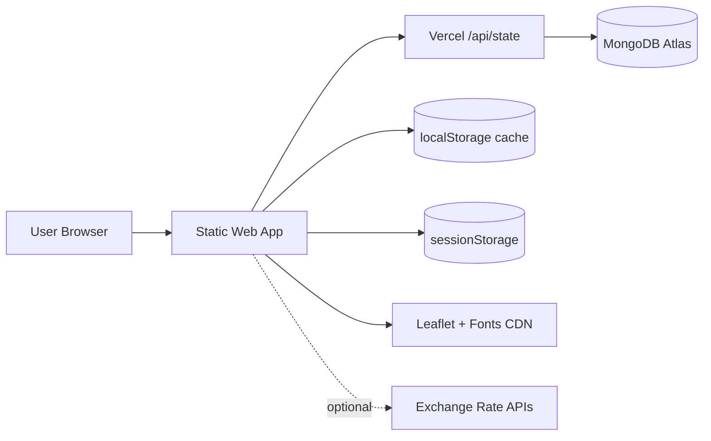
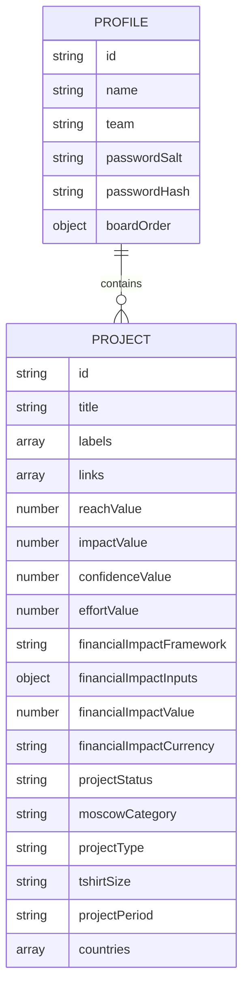
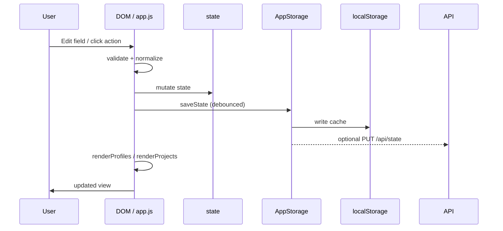
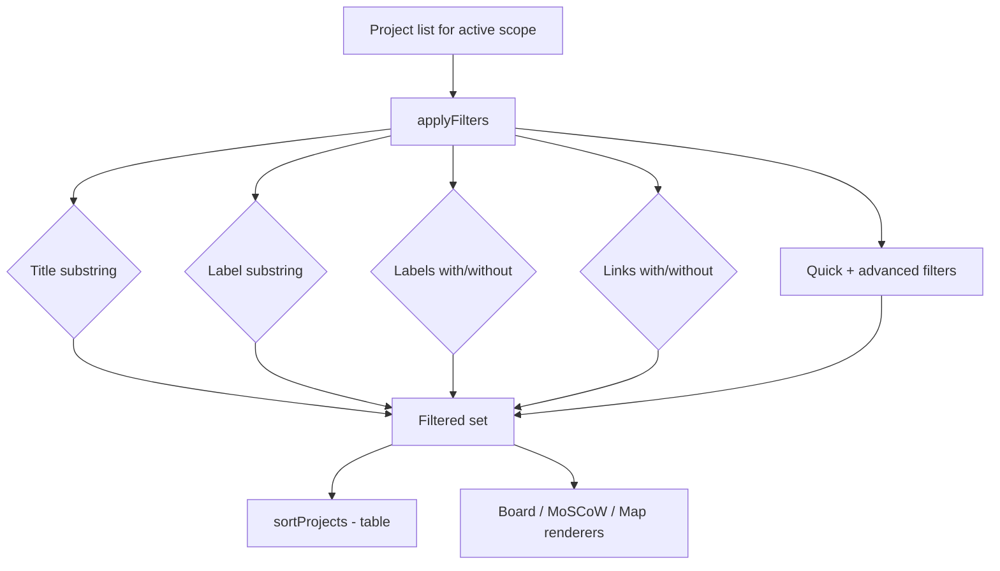
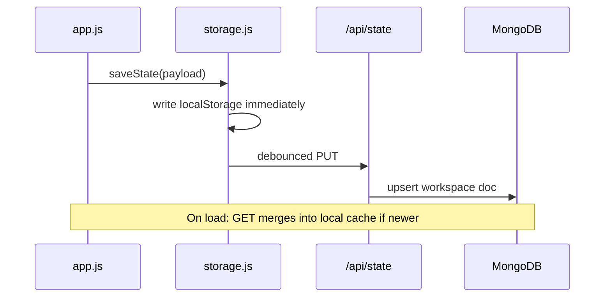
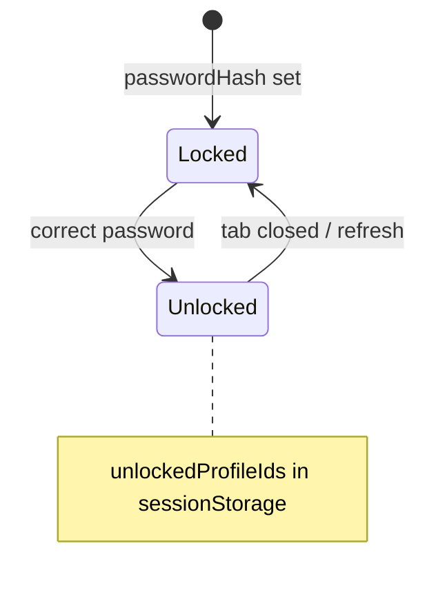
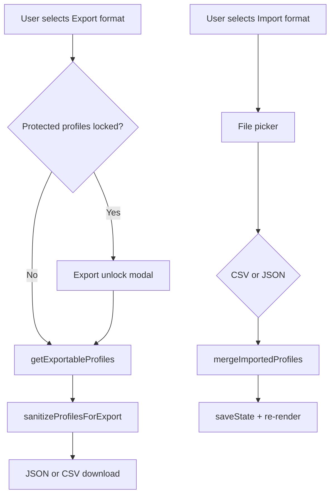

# Architecture Overview

| Field | Value |
|-------|-------|
| **Last audited** | 2026-05-28 |
| **Asset baseline** | `APP_ASSET_VERSION` = `20260528-ui152` |
| **Compact breakpoint** | `COMPACT_LAYOUT_MAX_WIDTH_PX` = **1400** |

---

## 1. System context

The UI is a **static SPA** (`index.html` + `src/`). On Vercel, **serverless routes** persist workspace JSON in MongoDB. Business logic (RICE, filters, render) remains client-side; `src/modules/storage.js` coordinates load/save and debounced cloud sync.

---

## 2. Module responsibilities

| Module / file | Responsibility |
|---------------|----------------|
| `index.html` | DOM: header, profiles, portfolio views, filters, modals, site footer |
| `src/constants.js` | `STORAGE_KEY`, `APP_ASSET_VERSION`, `COMPACT_LAYOUT_MAX_WIDTH_PX`, enums, tooltips, `TABLE_GROUP_BY_OPTIONS`, `moscowDisplayNames` |
| `src/utils.js` | Dates, CSV, HTML escape, country flags, IDs, legacy field stripping |
| `src/rice.js` | `calculateRiceScore`, `validateProjectInput`, `formatRice` |
| `src/modules/profile-security.js` | PBKDF2 password hash/verify |
| `src/modules/exchange-rates.js` | Fetch/cache FX to EUR |
| `src/modules/fullscreen.js` | Fullscreen API; compact media query uses `COMPACT_LAYOUT_MAX_WIDTH_PX` |
| `src/modules/overlay-manager.js` | Single-popup coordination (modals, sheets, menus) |
| `src/modules/storage.js` | MongoDB vs local persistence, migration, debounced sync |
| `api/health.js` | Storage backend probe |
| `api/state.js` | GET/PUT workspace document |
| `src/app.js` | Bootstrap, `state`, events, rendering, filters, autocomplete, import/export, layout classes |
| `css/*` | Layered presentation (see §10) |

---

## 3. Data model (logical)

Workspace payload also persists UI preferences: `projectsView`, `tableGroupBy`, sort fields, map metric, RICE sort toggles, exchange-rate cache, and privileged workspace mode flag (see [GUARDRAILS.md §7](GUARDRAILS.md)).

---

## 4. Request / interaction flow

---

## 5. Layout class architecture

`initCompactLayoutClass()` in `src/app.js` runs on load and `resize`:

| Viewport | `<html>` classes | UX |
|----------|----------------|-----|
| ≤ `COMPACT_LAYOUT_MAX_WIDTH_PX` (1400) | `is-compact-layout`, `is-phone-layout` | Profile picker, bottom-sheet profiles, card table, FAB, flat layout flow |
| > 1400 | `is-desktop-layout` | Sidebar profiles, data table grid |

Additional classes (mutually exclusive where noted):

| Class | When |
|-------|------|
| `is-workspace-trust-profile` | Active profile matches trust profile (gates privileged UI chrome) |
| `is-workspace-wide-mode` | Privileged cross-profile mode active ([GUARDRAILS.md §7](GUARDRAILS.md)) |

CSS layers use `@media (max-width: 1400px)` aligned with the constant — not legacy 1024px breakpoints.

---

## 6. View rendering

| View | Container | Renderer | Data gate |
|------|-----------|----------|-----------|
| Table (desktop) | `#projectsTableBody` | `renderProjectsTable` | `getUnlockedActiveProfile()` or workspace-wide project list |
| Table (compact) | Card list host | Compact card renderer + optional group headers | Same gate |
| Board | `#scrumBoardContainer` | `renderScrumBoard` | unlocked / workspace-wide |
| MoSCoW | `#moscowBoardContainer` | `renderMoscowBoard` | unlocked / workspace-wide |
| Map | `#projectsMapContainer` | `renderProjectsMap` | unlocked + Leaflet |

`state.projectsView` controls visibility; switching views does not clear data.

---

## 7. Filter pipeline

1. Resolve project array (single profile or workspace-wide per §7).
2. `applyFilters(projects)` applies search, quick, and advanced filters.
3. Table: sort + semantic columns; compact: optional `tableGroupBy` section headers.

---

## 8. Filter autocomplete subsystem

| Kind | Source | UI |
|------|--------|-----|
| Title | Distinct titles in scope | `#filterTitle` + listbox |
| Label | Distinct labels in scope | `#filterLabel` + listbox |

`initFilterAutocompletes()` wires keyboard navigation, highlight, and max **12** suggestions (`FILTER_AUTOCOMPLETE_MAX_SUGGESTIONS`).

---

## 9. MoSCoW compact navigation

On compact layout, `#moscowCompactNav` renders 2×2 pills with display names from `getMoscowDisplayName()`. `syncMoscowCompactNav()` + `IntersectionObserver` syncs active pill to visible quadrant while scrolling.

---

## 10. CSS layering (compact-aware)

Load order in `index.html` (later wins at equal specificity). All linked with `?v=APP_ASSET_VERSION`.

| # | File | Role |
|---|------|------|
| 1 | `main.css` | Base tokens, legacy modals |
| 2 | `workspace-modern.css` | Workspace shell |
| 3 | `header-modern.css` | App header |
| 4 | `profiles-modern.css` | Profiles panel + compact bottom sheet |
| 5 | `portfolio-modern.css` | Portfolio, filters, autocomplete |
| 6 | `profile-modals-modern.css` | Profile modals |
| 7 | `export-modals-modern.css` | Import/export modals |
| 8 | `view-toolbars-modern.css` | View toolbars |
| 9 | `compact-modern.css` | Compact chrome (≤1400px) |
| 10 | `moscow-compact.css` | MoSCoW compact layout |
| 11 | `board-compact.css` | Board compact layout |
| 12 | `table-compact.css` | Table compact toolbar |
| 13 | `project-actions-modern.css` | Row/card actions |
| 14 | `fullscreen-modern.css` | Fullscreen desktop |
| 15 | `fullscreen-compact.css` | Fullscreen compact |
| 16 | `app-footer.css` | Site footer |
| 17 | `views-density.css` | Density tokens |
| 18 | `layout-flow.css` | Flat workspace flow (≤1400px) |
| 19 | `portfolio-cards-compact.css` | Board/MoSCoW card shells |
| 20 | `table-rows-modern.css` | Table row styling |
| 21 | `table-revamp-modern.css` | Semantic column widths |
| 22 | `table-compact-cards.css` | Table card list (≤1400px) |
| 23 | `super-admin-modern.css` | Workspace-wide mode chrome (see GUARDRAILS §7) |

---

## 11. Cloud sync architecture

- **Local-first:** UI reads/writes `localStorage` key `rice_prioritizer_v1`.
- **Cloud optional:** When `MONGODB_URI` and API routes are configured on Vercel, `AppStorage` syncs the same JSON document.
- **Per-origin isolation:** localhost, preview, and production each have separate storage.
- **Failure mode:** Cloud errors log to console; local cache remains authoritative until user retries.

See [DEPLOYMENT.md](DEPLOYMENT.md) for environment variables.

---

## 12. Profile lock subsystem

Locked state blocks: project list, board, MoSCoW, map, filters (disabled).

---

## 13. Export / import architecture

---

## 14. Deployment architecture

- **Vercel** serves static files from repo root.
- `vercel.json`: security headers (CSP), cache rules.
- Canonical production origin: `PRODUCTION_APP_ORIGIN` in `constants.js`.

---

## 15. Known architectural constraints

- Monolithic `app.js` (~9k+ lines) — acceptable for static app; split only with clear module boundaries if growth continues.
- Global namespace — naming collisions require discipline.
- Full re-render on state change — optimize only if measured pain at scale.

See [GUARDRAILS.md](GUARDRAILS.md).
