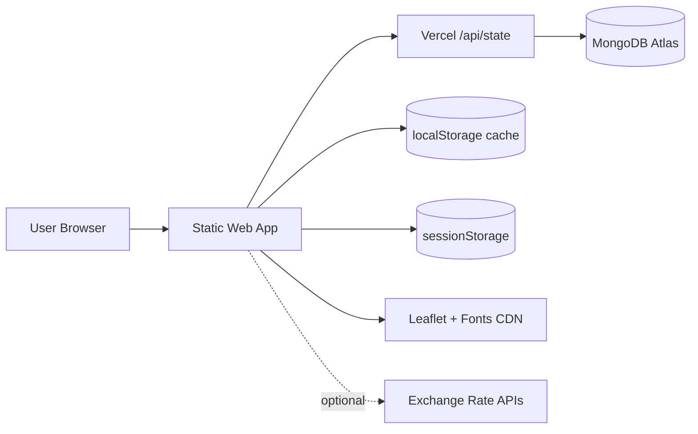
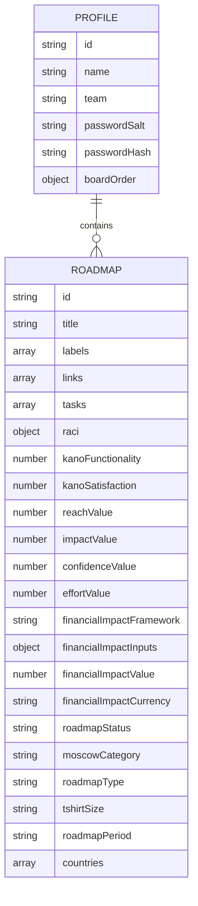
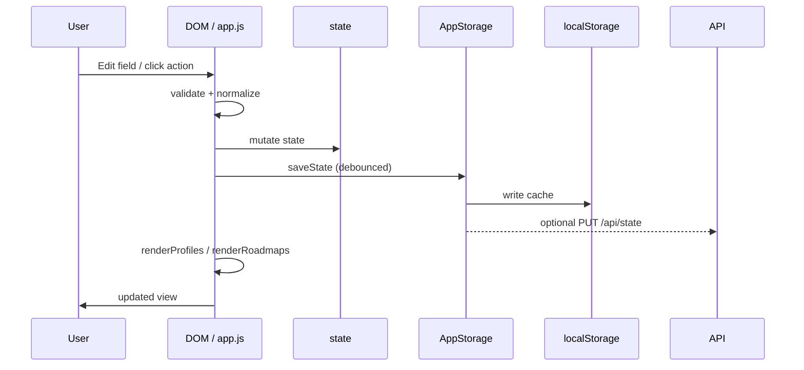
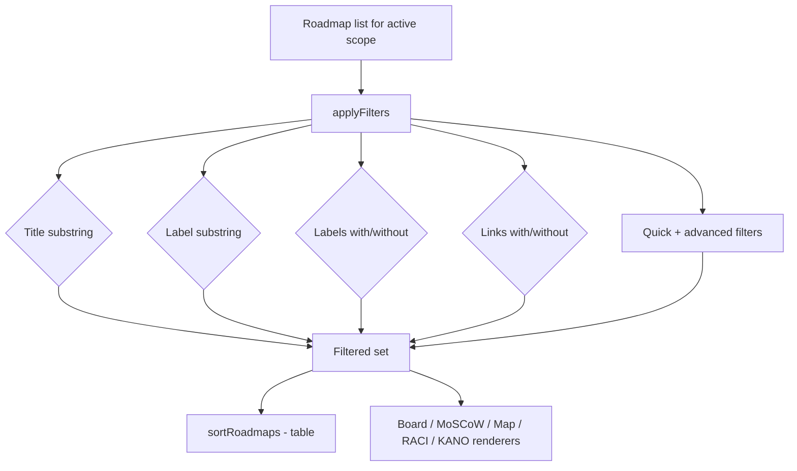
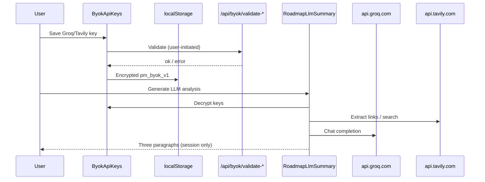
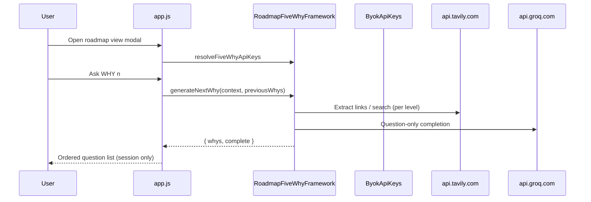
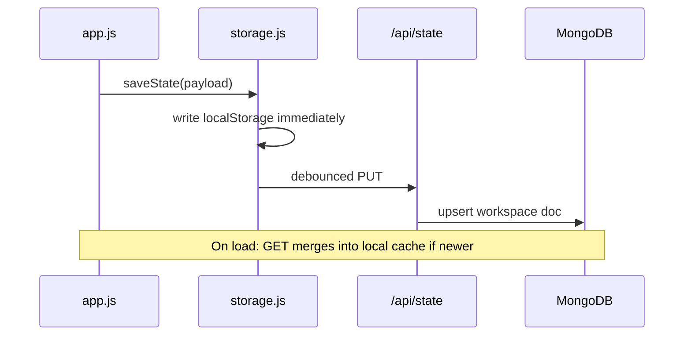
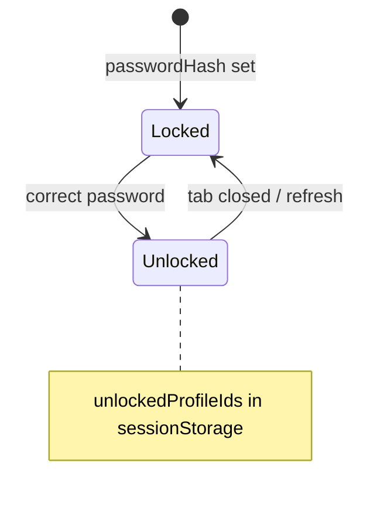
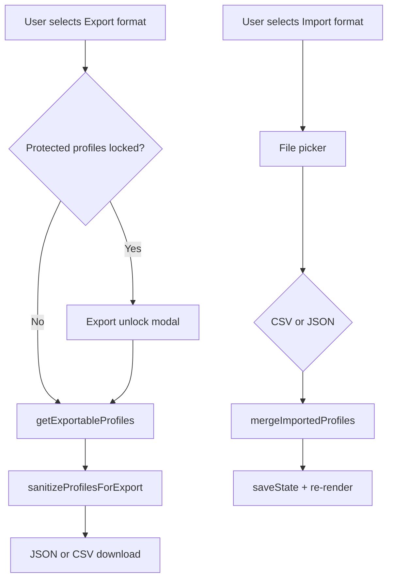

# Architecture Overview

> Cross-feature logic: [FEATURE_LOGIC_AND_CONSTRAINTS.md](FEATURE_LOGIC_AND_CONSTRAINTS.md)

| Field | Value |
|-------|-------|
| **Last audited** | 2026-06-29 |
| **Asset baseline** | `APP_ASSET_VERSION` = `20260629-ui195` |
| **Compact breakpoint** | `COMPACT_LAYOUT_MAX_WIDTH_PX` = **1400** |

---

## 1. System context

The UI is a **static SPA** (`index.html` + `src/`). On Vercel, **serverless routes** persist workspace JSON in MongoDB. Business logic (RICE, filters, render) remains client-side; `src/modules/storage.js` coordinates load/save and debounced cloud sync.

---

## 2. Module responsibilities

| Module / file | Responsibility |
|---------------|----------------|
| `index.html` | DOM: header, profiles, portfolio views, filters, modals, site footer |
| `src/constants.js` | `STORAGE_KEY`, `APP_ASSET_VERSION`, `COMPACT_LAYOUT_MAX_WIDTH_PX`, enums, tooltips, `TABLE_GROUP_BY_OPTIONS`, `moscowDisplayNames` |
| `src/utils.js` | Dates, CSV, HTML escape, country flags, IDs, legacy field stripping |
| `src/rice.js` | `calculateRiceScore`, `validateRoadmapInput`, `formatRice` |
| `src/modules/profile-security.js` | PBKDF2 password hash/verify |
| `src/modules/exchange-rates.js` | Fetch/cache FX to EUR |
| `src/modules/fullscreen.js` | Fullscreen API; compact media query uses `COMPACT_LAYOUT_MAX_WIDTH_PX` |
| `src/modules/overlay-manager.js` | Single-popup coordination (modals, sheets, menus) |
| `src/modules/storage.js` | MongoDB vs local persistence, debounced sync, flush on roadmap save, pull guard |
| `src/modules/description-format.js` | Sanitize/render description HTML |
| `src/modules/rich-text-editor.js` | RichTextEditor mount for description fields |
| `src/modules/board-drag.js` | Board drag-and-drop visuals |
| `src/modules/board-card-interaction.js` | Board card press feedback |
| `src/modules/byok-api-keys.js` | Encrypted local Groq/Tavily API keys (`ByokApiKeys`) |
| `src/modules/roadmap-llm-summary.js` | Tavily research + Groq roadmap briefing (`RoadmapLlmSummary`) |
| `src/modules/roadmap-5why-framework.js` | Iterative WHY 1→5 questions (`RoadmapFiveWhyFramework`) |
| `src/modules/roadmap-periods.js` | Multi-quarter `roadmapPeriods` normalize/validate (`RoadmapPeriods`) |
| `src/modules/export-payload.js` | JSON/CSV export builders (`ExportPayload`) |
| `api/health.js` | Storage backend probe |
| `api/config.js` | Client config probe (same as health) |
| `api/state.js` | GET/PUT workspace document |
| `api/byok/validate-groq.js` | POST validate Groq BYOK key |
| `api/byok/validate-tavily.js` | POST validate Tavily BYOK key |
| `api/_lib/roadmap-metadata.js` | Server-side normalize: labels, links, tasks, RACI, KANO, note; legacy migration |
| `api/_lib/byok-validate.js` | Shared BYOK key normalization and provider probes |
| `src/app.js` | Bootstrap, `state`, events, rendering, filters, autocomplete, import/export, bulk transfer |
| `css/*` | Layered presentation (see §10) |

---

## 3. Data model (logical)

Workspace payload also persists UI preferences: `roadmapsView`, `tableGroupBy`, sort fields, map metric, RICE sort toggles, exchange-rate cache, and privileged workspace mode flag (see [GUARDRAILS.md §7](GUARDRAILS.md)).

---

## 4. Request / interaction flow

---

## 5. Layout class architecture

`initCompactLayoutClass()` in `src/app.js` runs on load and `resize`:

| Viewport | `<html>` classes | UX |
|----------|----------------|-----|
| ≤ `COMPACT_LAYOUT_MAX_WIDTH_PX` (1400) | `is-compact-layout`, `is-phone-layout` | Profile picker, bottom-sheet profiles, card table, FAB, flat layout flow |
| > 1400 | `is-desktop-layout` | Sidebar profiles, data table grid |

Additional classes (mutually exclusive where noted):

| Class | When |
|-------|------|
| `is-workspace-trust-profile` | Active profile matches trust profile (gates privileged UI chrome) |
| `is-workspace-wide-mode` | Privileged cross-profile mode active ([GUARDRAILS.md §7](GUARDRAILS.md)) |

CSS layers use `@media (max-width: 1400px)` aligned with the constant — not legacy 1024px breakpoints.

---

## 6. View rendering

| View | Container | Renderer | Data gate |
|------|-----------|----------|-----------|
| Table (desktop) | `#roadmapsTableBody` | `renderRoadmapsTable` | `getUnlockedActiveProfile()` or workspace-wide roadmap list |
| Table (compact) | Card list host | Compact card renderer + optional group headers | Same gate |
| Board | `#scrumBoardContainer` | `renderScrumBoard` | unlocked / workspace-wide |
| MoSCoW | `#moscowBoardContainer` | `renderMoscowBoard` | unlocked / workspace-wide |
| Map | `#roadmapsMapContainer` | `renderRoadmapsMap` | unlocked + Leaflet |
| RACI | `#roadmapsRaciView` | `renderRaciMatrix` | unlocked / workspace-wide |
| KANO | `#roadmapsKanoView` | `renderKanoPortfolioMatrix` | unlocked / workspace-wide |

`state.roadmapsView` controls visibility; switching views does not clear data.

---

## 7. Filter pipeline

1. Resolve roadmap array (single profile or workspace-wide per §7).
2. `applyFilters(roadmaps)` applies search, quick, and advanced filters.
3. Table: sort + semantic columns; compact: optional `tableGroupBy` section headers.

---

## 8. Filter autocomplete subsystem

| Kind | Source | UI |
|------|--------|-----|
| Title | Distinct titles in scope | `#filterTitle` + listbox |
| Label | Distinct labels in scope | `#filterLabel` + listbox |

`initFilterAutocompletes()` wires keyboard navigation, highlight, and max **12** suggestions (`FILTER_AUTOCOMPLETE_MAX_SUGGESTIONS`).

---

## 9. MoSCoW compact layout

On compact layout (≤1400px), the MoSCoW board uses a single-column quadrant stack in `moscow-compact.css`. Quadrant headers use display names from `getMoscowDisplayName()` (**Must Have**, **Should Have**, etc.). Users scroll the board directly; the legacy compact jump-nav was removed.

---

## 10. CSS layering (compact-aware)

Load order in `index.html` lines 15–52 (later wins at equal specificity). Each file uses a **per-asset** `?v=` tag; see [TECH_GUIDELINES.md](TECH_GUIDELINES.md) §3.1 for the full 38-file table.

| # | File | Role |
|---|------|------|
| 1–17 | `main.css` … `app-footer.css` | Base shell through footer |
| 18–28 | `views-density.css` … `view-toolbars-compact-row.css` | Density, tables, board, toolbars |
| 29–34 | `filters-compact-bar.css` … `view-tabs-compact-menu.css` | Filters sheet, mobile command deck, profile picker, view overflow |
| 35–38 | `rich-description-content.css` … `confirm-modals-modern.css` | Rich text, KANO, confirm dialogs |

---

## 11. BYOK and LLM analysis (optional)

BYOK data is **outside** the workspace MongoDB document. LLM output is **not** persisted on roadmap entities.

### 11.1 Five Why Framework (optional)

Five Why is **view-only**, shares BYOK keys with LLM Summary, and stores output in `roadmapFiveWhyGenerated` (not on roadmap entity).

---

## 12. Cloud sync architecture

- **Local-first:** UI reads/writes `localStorage` key `rice_prioritizer_v1`.
- **Cloud optional:** When `MONGODB_URI` and API routes are configured on Vercel, `AppStorage` syncs the same JSON document.
- **Per-origin isolation:** localhost, preview, and production each have separate storage.
- **Failure mode:** Cloud errors log to console; local cache remains authoritative until user retries.

See [DEPLOYMENT.md](DEPLOYMENT.md) for environment variables.

---

## 13. Profile lock subsystem

Locked state blocks: roadmap list, board, MoSCoW, map, filters (disabled).

---

## 14. Export / import architecture

---

## 15. Deployment architecture

- **Vercel** serves static files from repo root.
- `vercel.json`: security headers (CSP), cache rules.
- Canonical production origin: `PRODUCTION_APP_ORIGIN` in `constants.js`.

---

## 16. Known architectural constraints

- Monolithic `app.js` (~23k lines) — acceptable for static app; split only with clear module boundaries if growth continues.
- Global namespace — naming collisions require discipline.
- Full re-render on state change — optimize only if measured pain at scale.

See [GUARDRAILS.md](GUARDRAILS.md).
