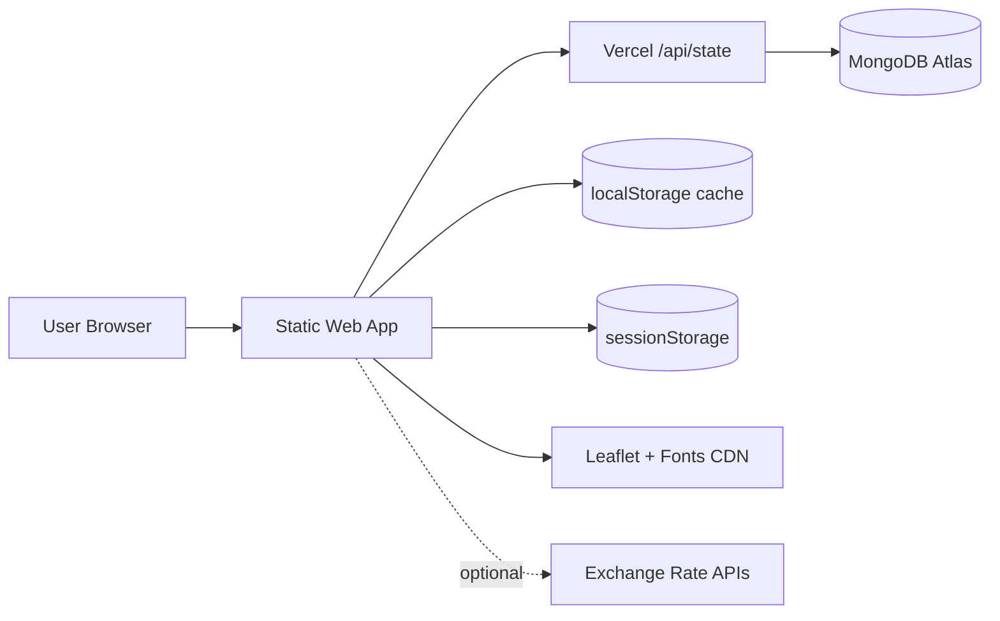
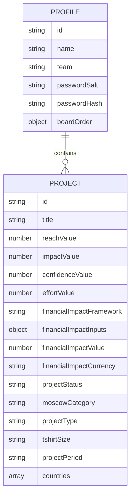
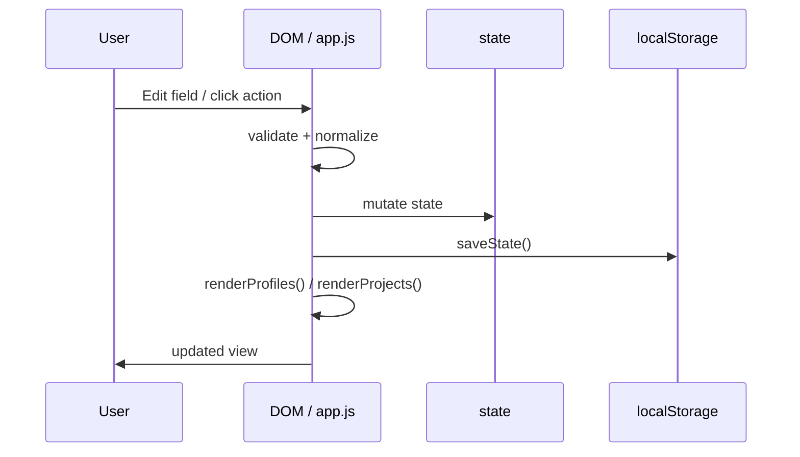
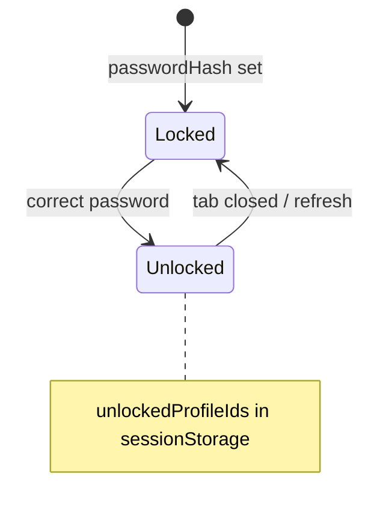
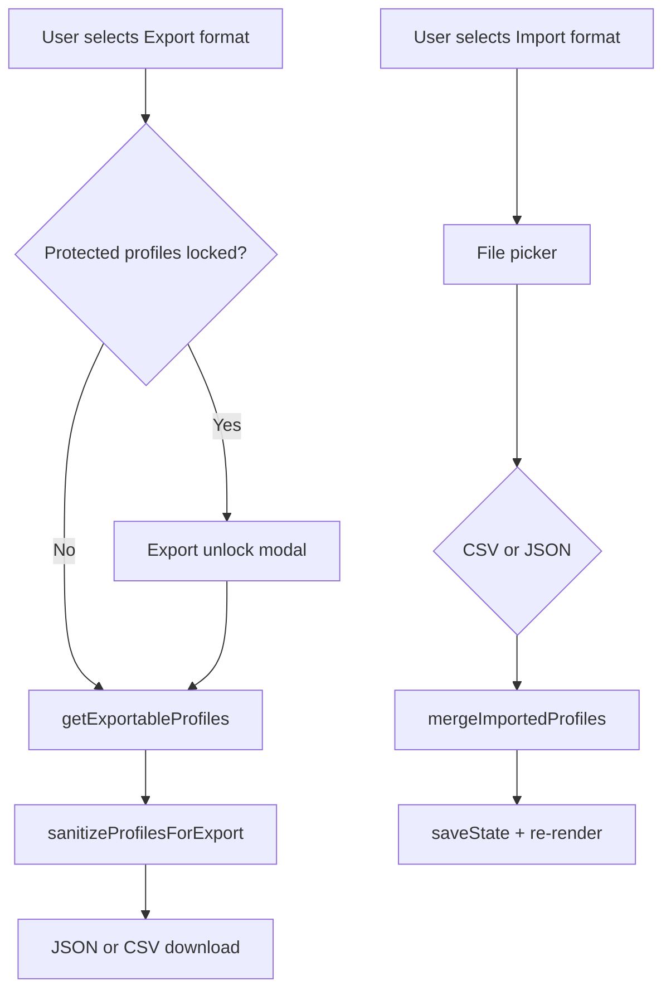

# Architecture Overview

**Last audited:** 2026-05-27

---

## 1. System context

The UI is a **static SPA** (`index.html` + `src/`). On Vercel, **serverless routes** persist workspace JSON in MongoDB. Business logic (RICE, filters, render) remains client-side; `src/modules/storage.js` coordinates load/save.

---

## 2. Module responsibilities

| Module / file | Responsibility |
|---------------|----------------|
| `index.html` | DOM structure: header, profiles panel, portfolio views, modals |
| `src/constants.js` | Storage key, enums (status, MoSCoW, currencies, countries), tooltip copy |
| `src/utils.js` | Dates, CSV, HTML escape, country flags, IDs |
| `src/rice.js` | `calculateRiceScore`, `validateProjectInput`, `formatRice` |
| `src/modules/profile-security.js` | PBKDF2 password hash/verify |
| `src/modules/exchange-rates.js` | Fetch/cache FX to EUR |
| `src/modules/fullscreen.js` | Fullscreen API for views |
| `src/modules/overlay-manager.js` | Single-popup coordination (modals, sheets, menus) |
| `src/modules/storage.js` | MongoDB vs local persistence, migration, debounced sync |
| `api/health.js` | Storage backend probe |
| `api/state.js` | GET/PUT workspace document |
| `src/app.js` | `init()` bootstrap, state, events, rendering, filters, import/export, modals |
| `css/*` | Layered presentation: modern workspace + **compact-*** layers for ≤1024px (see [DESIGN_GUIDELINES.md](DESIGN_GUIDELINES.md)) |

---

## 3. Data model (logical)

---

## 4. Request / interaction flow

---

## 5. View rendering

| View | Container | Renderer | Data gate |
|------|-----------|----------|-----------|
| Table | `#projectsTableBody` | `renderProjectsTable` | `getUnlockedActiveProfile()` |
| Board | `#scrumBoardContainer` | `renderScrumBoard` | unlocked profile |
| MoSCoW | `#moscowBoardContainer` | `renderMoscowBoard` | unlocked profile |
| Map | `#projectsMapContainer` | `renderProjectsMap` | unlocked profile + Leaflet |

`state.projectsView` controls visibility; switching views does not clear data.

---

## 6. Filter pipeline

1. Start from active profile’s `projects` array (if unlocked).
2. `applyFilters(projects)` applies quick + advanced filters (title, type, countries, period, RICE ranges, framework, status, MoSCoW, etc.).
3. `sortProjects` orders table; board/MoSCoW may apply separate RICE sort toggles.

---

## 7. Tooltip subsystem

- Wrapper elements host `.cell-type-tooltip` content.
- `showCellTypeTooltip` / `hideCellTypeTooltips` manage visibility.
- `activeTooltipWrap` enforces **one tooltip at a time**.
- Project modal: `ensureProjectFormFieldTooltips` injects standardized copy for fields.

---

## 8. Profile lock subsystem

Locked state blocks: project list, board, MoSCoW, map, filters (disabled). Inline banner unlock + modal unlock for profile actions.

---

## 9. Export / import architecture

---

## 10. Deployment architecture

- **Vercel** serves static files from repo root.
- `vercel.json`: security headers (CSP), cache rules.
- Each origin (localhost, preview, production) has **isolated** `localStorage`.

See [DEPLOYMENT.md](DEPLOYMENT.md).

---

## 11. Known architectural constraints

- Monolithic `app.js` (~7k+ lines) — acceptable for static app; split only with clear module boundaries if growth continues.
- Global namespace — naming collisions require discipline.
- Full re-render — optimize only if measured pain at scale.

See [GUARDRAILS.md](GUARDRAILS.md).
