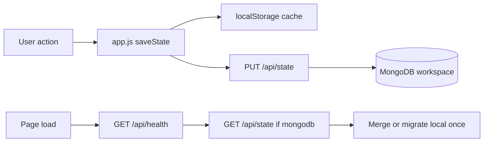
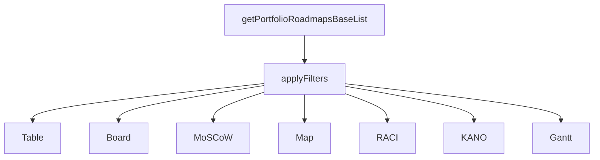
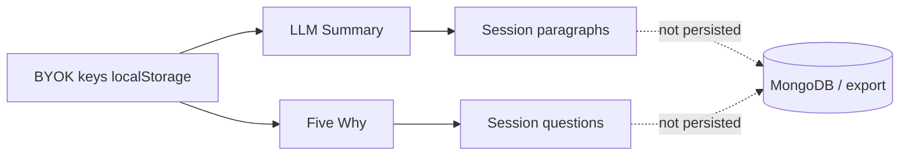

# Feature Logic, Rules, and Constraints

| Field | Value |
|-------|-------|
| **Product** | Product Management Prioritization Tool |
| **Version** | 2.0.0 |
| **Audience** | Product, engineering, design, QA, and stakeholders |
| **Maintainer** | Product Team |
| **Last updated** | 2026-05-28 |
| **Implementation baseline** | `APP_ASSET_VERSION` = `20260528-ui196` |

This document is the **collaborative cross-feature reference** for how the app behaves end-to-end. It explains **logic** (what the system does), **rules** (what inputs and workflows are allowed), and **constraints** (what the product must not do or cannot guarantee). Use it in planning reviews, QA test design, and cross-team alignment.

**Companion documents** (detail by specialty):

| Need | Document |
|------|----------|
| Requirements IDs | [PRD.md](PRD.md) |
| Acceptance criteria | [USER_STORIES.md](USER_STORIES.md) |
| Variable names & formulas | [VARIABLES.md](VARIABLES.md) |
| Hard limits & security policy | [GUARDRAILS.md](GUARDRAILS.md) |
| Planning rubrics | [BUSINESS_GUIDELINES.md](BUSINESS_GUIDELINES.md) |
| Modules & data flow | [ARCHITECTURE.md](ARCHITECTURE.md) |
| UI tokens & components | [DESIGN_GUIDELINES.md](DESIGN_GUIDELINES.md) |

---

## How teams use this document

| Role | Typical use |
|------|-------------|
| **Product / PM** | Confirm feature behavior before workshops; align stories with real constraints |
| **Engineering** | Onboard to feature boundaries before changing `app.js` or modules |
| **Design** | Understand when UI differs by layout (desktop vs compact) or mode |
| **QA** | Derive test cases from rules + constraints; verify cross-view consistency |
| **Leadership** | See what the tool does and does not promise (especially AI and financial outputs) |

**When to update:** Any user-visible behavior change in the same delivery as [CHANGELOG.md](CHANGELOG.md). Update the relevant feature section here, then cross-link PRD / user stories / guardrails as needed.

---

## Cross-cutting foundations

### F-00 Workspace and persistence

| Aspect | Detail |
|--------|--------|
| **Purpose** | Hold all profiles, roadmaps, UI preferences, and FX cache in one workspace document |
| **Logic** | `saveState()` serializes `state` → `localStorage` (`STORAGE_KEY` = `rice_prioritizer_v1`) → optional debounced `PUT /api/state` when MongoDB is configured |
| **Rules** | Only keys in `WORKSPACE_PERSISTED_STATE_KEYS` plus `profiles[]` are written; session-only AI output is excluded |
| **Constraints** | MongoDB document size ~16 MB; no multi-user locking; preview and production origins have separate browser caches unless same domain + workspace id |
| **Code** | `src/modules/storage.js`, `api/state.js`, `src/constants.js` |
| **See also** | [DEPLOYMENT.md](DEPLOYMENT.md), [VARIABLES.md](VARIABLES.md) §1 |

### F-01 Layout and responsive behavior

| Aspect | Detail |
|--------|--------|
| **Purpose** | One desktop experience (>1400px) and one unified compact phone/tablet UI (≤1400px) |
| **Logic** | `initCompactLayoutClass()` sets `html.is-compact-layout` + `html.is-phone-layout` or `html.is-desktop-layout` from `COMPACT_LAYOUT_MAX_WIDTH_PX` (1400) |
| **Rules** | No tablet-only hybrid breakpoint; compact uses vertical stacks, FAB, selection bar, MoSCoW nav pills |
| **Constraints** | Board and MoSCoW must not require horizontal scroll in compact; table bulk delete uses floating selection bar on compact |
| **Code** | `src/app.js`, `src/constants.js`, `css/compact-modern.css` and view-specific compact CSS |
| **See also** | [DESIGN_GUIDELINES.md](DESIGN_GUIDELINES.md), [GUARDRAILS.md](GUARDRAILS.md) §3.1 |

### F-02 Single-profile vs workspace-wide scope

| Aspect | Detail |
|--------|--------|
| **Purpose** | Default: user works inside one active profile; optional mode shows all profiles’ roadmaps |
| **Logic** | `getPortfolioRoadmapsBaseList()` returns active profile roadmaps, or all roadmaps with owner metadata when privileged workspace mode is active |
| **Rules** | Owner filter, Profile column, and cross-profile card strips appear **only** when mode is active; writes persist to each roadmap’s owner profile |
| **Constraints** | Eligibility, toggle placement, and safety copy are defined **only** in [GUARDRAILS.md §7](GUARDRAILS.md); do not duplicate policy in other docs |
| **Code** | `isSuperAdminModeActive()`, `getPortfolioRoadmapsBaseList()`, `state.superAdminMode` |
| **See also** | [USER_STORIES.md](USER_STORIES.md) (privileged mode stories), [TRACEABILITY_MATRIX.md](TRACEABILITY_MATRIX.md) FR-10 |

### F-03 Filter pipeline (shared across views)

| Aspect | Detail |
|--------|--------|
| **Purpose** | One filtered roadmap set drives Table, Board, MoSCoW, Map, RACI, and KANO |
| **Logic** | Resolve scope → `applyFilters(roadmaps)` → view-specific sort/render |
| **Rules** | Filters combine with AND semantics; empty filter = no constraint; title/label use case-insensitive substring; owner profile filter only in privileged mode |
| **Constraints** | Autocomplete max **12** suggestions; filters drawer collapsed by default on compact |
| **Code** | `applyFilters()`, `initFilterAutocompletes()`, filter DOM in `index.html` |
| **See also** | [ARCHITECTURE.md](ARCHITECTURE.md) §7–8, [PRD.md](PRD.md) FR-6 |

**Filter inventory**

| Filter | Logic |
|--------|-------|
| Title | Substring match on `roadmap.title` |
| Label | Substring match on any label |
| Labels presence | `with` / `without` / any |
| Links presence | `with` / `without` / any |
| Roadmap type | Exact match; `__none__` = unset only |
| Countries | Multi-select; EU expands to member set |
| Period | Multi-select `YYYY-Qn` |
| Impact / Effort | Exact RICE dimension match |
| Currency | Exact `financialImpactCurrency` |
| Framework | Normalized `financialImpactFramework` |
| Status | Exact `roadmapStatus` |
| T-shirt | Exact or `__none__` |
| MoSCoW | Exact stored category |
| Owner profile | Exact `ownerProfileId` (privileged mode only) |

---

## Core domain features

### F-10 Profiles

| Aspect | Detail |
|--------|--------|
| **Purpose** | Isolate portfolios (team, product, or owner) within one workspace |
| **Logic** | CRUD via profile panel/modals; `activeProfileId` selects context; search filters panel list |
| **Rules** | Name required on create; optional team label; demo profile (`Test`) is **read-only** when active |
| **Constraints** | No server-side profile ACL; password protects content visibility, not cloud document access |
| **Code** | `src/app.js` profile handlers, `css/profiles-modern.css` |
| **See also** | [PRD.md](PRD.md) FR-1, [USER_PERSONAS.md](USER_PERSONAS.md) |

### F-11 Profile password lock

| Aspect | Detail |
|--------|--------|
| **Purpose** | Optional PBKDF2 protection per profile |
| **Logic** | Hash stored on profile; unlock stores profile id in `sessionStorage` (`pmTool_unlockedProfileIds_v1`) for current tab session |
| **Rules** | Plaintext password never persisted; locked profile blocks roadmap list and mutations until unlock |
| **Constraints** | Session unlock clears on tab close/refresh; export omits locked profiles unless verified in export dialog |
| **Code** | `src/modules/profile-security.js`, unlock banners/modals in `app.js` |
| **See also** | [GUARDRAILS.md](GUARDRAILS.md) §6.1, [PRD.md](PRD.md) FR-1 |

### F-12 Roadmaps (entity and modal)

| Aspect | Detail |
|--------|--------|
| **Purpose** | Single initiative record with scoring, metadata, and optional extensions |
| **Logic** | Create/edit/view modal with section navigation; stable `roadmap.id`; normalize on load/save via `normalizeLoadedRoadmap` |
| **Rules** | Title and description (plain text after sanitize) required; period format `YYYY-Qn`; links validated for URL shape |
| **Constraints** | LLM and Five Why sections are view-only and session-only; CSV export uses plain text for descriptions |
| **Code** | `handleRoadmapFormSubmit()`, `src/utils.js`, `api/_lib/roadmap-metadata.js` |
| **See also** | [VARIABLES.md](VARIABLES.md) §3, [PRD.md](PRD.md) FR-2 |

**Modal sections (create / edit / view)**

| Section | Create | Edit | View | Persisted |
|---------|--------|------|------|-----------|
| Roadmap core | ✓ | ✓ | ✓ | ✓ |
| RICE | ✓ | ✓ | ✓ | ✓ |
| MoSCoW | ✓ | ✓ | ✓ | ✓ |
| KANO | ✓ | ✓ | ✓ | ✓ |
| Meta (labels, links, tasks) | ✓ | ✓ | ✓ | ✓ |
| RACI | ✓ | ✓ | ✓ | ✓ |
| Financial | ✓ | ✓ | ✓ | ✓ |
| Note (rich text) | ✓ | ✓ | ✓ | ✓ |
| Five Why | — | — | ✓ | Session only |
| Summary (LLM) | — | — | ✓ | Session only |

### F-13 RICE scoring

| Aspect | Detail |
|--------|--------|
| **Purpose** | Explainable priority score across views and sorts |
| **Logic** | `calculateRiceScore`: `(Reach × Impact × Confidence) ÷ Effort`; confidence >1 treated as percentage ÷100 |
| **Rules** | Reach: non-negative integer; Impact/Effort: 1–5; Confidence: 0–100; all validated in `validateRoadmapInput` |
| **Constraints** | Missing inputs yield non-finite score; table/board default sort can prefer RICE descending |
| **Code** | `src/rice.js`, RICE fields in roadmap modal |
| **See also** | [BUSINESS_GUIDELINES.md](BUSINESS_GUIDELINES.md) §2, [VARIABLES.md](VARIABLES.md) |

### F-14 MoSCoW classification

| Aspect | Detail |
|--------|--------|
| **Purpose** | Delivery intent quadrant independent of RICE sort order |
| **Logic** | Stored values: `Must have`, `Should have`, `Could have`, `Won't have`; UI display via `moscowDisplayNames` |
| **Rules** | MoSCoW view places cards in 2×2 grid; drag order per quadrant when RICE sort off |
| **Constraints** | Compact uses nav pills + vertical quadrants; no horizontal scroll |
| **Code** | `renderMoscowBoard()`, `moscowOrder` on profile, `css/moscow-compact.css` |
| **See also** | [BUSINESS_GUIDELINES.md](BUSINESS_GUIDELINES.md) §3 |

### F-14b Multi-quarter roadmap periods

| Aspect | Detail |
|--------|--------|
| **Purpose** | Track initiative delivery across multiple planning quarters with per-quarter status |
| **Logic** | `roadmapPeriods[]` of `{ period, status }`; `RoadmapPeriods.normalizePeriods`; chronologically latest entry drives `deriveRoadmapStatus` |
| **Rules** | Each period must match `YYYY-Q[1-4]`; duplicate quarters collapsed; legacy single `roadmapPeriod` migrates on load |
| **Constraints** | Filter still matches any period on roadmap; display shows comma-separated quarters |
| **Code** | `src/modules/roadmap-periods.js`, roadmap modal Periods section, `rice.js` validatePeriods |
| **See also** | [VARIABLES.md](VARIABLES.md) §5, `npm run test:periods` |

### F-15 Financial frameworks

| Aspect | Detail |
|--------|--------|
| **Purpose** | Planning-grade value estimate in chosen currency |
| **Logic** | Six frameworks: `custom`, `clv`, `nps`, `risk`, `headcount`, `operational`; `computeFrameworkFinancialImpact` derives value from allowed inputs only |
| **Rules** | Switching framework clears disallowed inputs; framework-specific validation messages; currency required when value non-zero |
| **Constraints** | Outputs are estimates, not accounting; NPS has segment retention ordering rules |
| **Code** | `sanitizeFinancialImpactInputs()`, `getFinancialFrameworkValidationMessage()`, financial section in modal |
| **See also** | [BUSINESS_GUIDELINES.md](BUSINESS_GUIDELINES.md) §4–5, [VARIABLES.md](VARIABLES.md) |

### F-16 Labels, links, and tasks

| Aspect | Detail |
|--------|--------|
| **Purpose** | Lightweight metadata for filtering, tooltips, and execution tracking |
| **Logic** | Labels: string array; links: `{ label, url }`; tasks: `{ name, status }`; normalized on server write |
| **Rules** | Duplicate labels collapsed; link URLs validated; task status from enum in UI |
| **Constraints** | Labels/links feed filters and LLM context; not a full task management system |
| **Code** | `getRoadmapLabelsFromControls()`, `roadmap-metadata.js`, filter label/link presence |
| **See also** | [PRD.md](PRD.md) FR-2.8–2.9 |

### F-17 Rich-text descriptions (six surfaces)

| Aspect | Detail |
|--------|--------|
| **Purpose** | Formatted narrative on roadmap core fields and RICE context |
| **Logic** | `RichTextEditor` mounts six `data-surface-id` fields: `roadmapDescription`, `roadmapNote`, and four RICE `*Description` fields; `description-format.js` sanitizes HTML (allowed tags, safe colors, bullet styles) for view, tooltips, LLM, and Five Why context |
| **Rules** | Roadmap **Description** required (plain text after sanitize); **Note** optional; RICE descriptions optional; view mode hides toolbar |
| **Constraints** | CSV export strips all six to plain text; `normalizeRoadmapNote` on save and cloud write |
| **Code** | `src/modules/rich-text-editor.js`, `css/rich-description-content.css`, `api/_lib/roadmap-metadata.js` |
| **See also** | [DESIGN_GUIDELINES.md](DESIGN_GUIDELINES.md) §2.6, [VARIABLES.md](VARIABLES.md) §8.11 |

### F-18 Optional collapsible roadmap sections

| Aspect | Detail |
|--------|--------|
| **Purpose** | Reduce modal clutter while keeping advanced fields discoverable |
| **Logic** | `initRoadmapFormOptionalDisclosures()` wraps optional blocks in `[data-optional-collapsible]`; auto-expands when section has saved data |
| **Rules** | Tasks, KANO, RACI, and similar optional groups collapse when empty on create |
| **Constraints** | Disclosure state is session UI only — not persisted in workspace |
| **Code** | `syncRoadmapOptionalDisclosures()`, `main.css` optional-section rules |
| **See also** | [DESIGN_GUIDELINES.md](DESIGN_GUIDELINES.md) |

### F-19 In-modal KANO helpers

| Aspect | Detail |
|--------|--------|
| **Purpose** | Set and preview KANO scores before portfolio matrix placement |
| **Logic** | `ensureRoadmapKanoAxisSelects`, meters, legend, and mini-matrix preview in roadmap modal KANO section |
| **Rules** | Axes 1–5 or null; category from `KANO_ZONE_MATRIX` |
| **Constraints** | Portfolio drag-and-drop is in KANO **view**, not modal |
| **Code** | `ensureRoadmapKanoMatrixMounted`, `renderRoadmapKanoResultMetrics` in `app.js` |
| **See also** | F-25 KANO portfolio view |

### F-54 Dev seed workspace (localhost)

| Aspect | Detail |
|--------|--------|
| **Purpose** | Sample data for local demos without manual entry |
| **Logic** | `dev-seed-workspace.js` gated to localhost; `?resetDevSeed=1` clears and re-seeds |
| **Rules** | Never runs on production origin |
| **Constraints** | Seed payload uses `clientId: "dev_seed"` in `_storageMeta`; never runs when cloud storage is active |
| **Code** | `src/dev-seed-workspace.js`, seed gate in `app.js` init |
| **See also** | [TECH_GUIDELINES.md](TECH_GUIDELINES.md) §2 |

---

## Portfolio views (seven)

All views consume the **same filtered roadmap set** unless noted.

### F-20 Table view

| Aspect | Detail |
|--------|--------|
| **Logic** | Desktop: semantic column grid; compact: card list with optional `tableGroupBy` section headers |
| **Rules** | Sort by RICE or column; multi-select enables bulk delete; privileged mode adds Profile column + bulk duplicate/move |
| **Constraints** | Compact bulk delete via floating selection bar, not desktop-only toolbar |
| **Code** | `renderRoadmaps()`, `css/table-revamp-modern.css`, `css/table-compact-cards.css` |

### F-21 Board (Scrum) view

| Aspect | Detail |
|--------|--------|
| **Logic** | Columns = subset of `roadmapStatusList`; cards filtered by visible status toggle; optional RICE sort within column |
| **Rules** | Drag-and-drop updates `boardOrder` when RICE sort off; status column filter in toolbar |
| **Constraints** | Desktop DnD; compact vertical stack per column |
| **Code** | `renderScrumBoard()`, `src/modules/board-drag.js` |

### F-22 MoSCoW view

| Aspect | Detail |
|--------|--------|
| **Logic** | 2×2 quadrants by `moscowCategory`; optional RICE sort; compact nav pills |
| **Rules** | Display names differ from stored filter values (Must Have vs Must have) |
| **Constraints** | Equal-height quadrants with internal scroll on desktop |
| **Code** | `renderMoscowBoard()`, `css/moscow-compact.css` |

### F-23 Map view

| Aspect | Detail |
|--------|--------|
| **Logic** | Leaflet choropleth by country; metric from `mapMetric`: count, RICE sum/avg, financial sum/avg (EUR via FX) |
| **Rules** | Country codes from `countryList` + EU aggregate; tooltips show breakdown; privileged mode can show per-profile split |
| **Constraints** | Requires network for tiles; FX cache in workspace state |
| **Code** | `renderRoadmapsMap()`, `src/modules/exchange-rates.js` |

### F-24 RACI matrix view

| Aspect | Detail |
|--------|--------|
| **Logic** | Matrix rows = roadmaps; columns = R/A/C/I; domain toggle `Business` / `Tech` (`raciMatrixDomain`) |
| **Rules** | RACI entries hold `name` + `domain`; normalized on save |
| **Constraints** | Matrix reflects filtered set only; editing in roadmap modal |
| **Code** | `renderRaciMatrix()`, roadmap modal RACI section |

### F-25 KANO portfolio view

| Aspect | Detail |
|--------|--------|
| **Logic** | `kanoFunctionality` × `kanoSatisfaction` (1–5) → category via `KANO_ZONE_MATRIX`; panels: positioned matrix vs unpositioned list |
| **Rules** | Both axes required for matrix placement; drag between cells updates scores on desktop |
| **Constraints** | Category legend fixed in `constants.js`; not a substitute for RICE |
| **Code** | `renderKanoPortfolioMatrix()`, `css/portfolio-kano-modern.css` |
| **See also** | [BUSINESS_GUIDELINES.md](BUSINESS_GUIDELINES.md) KANO section |

### F-26 Gantt timeline view

| Aspect | Detail |
|--------|--------|
| **Purpose** | Calendar planning: when initiatives run across quarters and when they are due |
| **Logic** | `GanttView.render()` builds ISO-week grid; each `roadmapPeriods[]` entry maps to quarter date range as colored bar segments; `roadmapDeadline` shows marker when set |
| **Rules** | Timeline spans filtered roadmaps ± padding weeks (min 52); zoom: `compact` (monthly), `standard` / `comfortable` (weekly); `state.ganttZoom` persisted |
| **Constraints** | Tooltips show period status and deadline hints; compact layout may default zoom to monthly |
| **Code** | `src/modules/gantt-view.js`, `css/gantt-view.css`, `#roadmapsGanttView` |
| **See also** | F-14b periods, `npm run test:gantt`, [PRD.md](PRD.md) FR-5.8 |

---

## Data portability and cloud

### F-30 Export

| Aspect | Detail |
|--------|--------|
| **Purpose** | Full workspace backup for disaster recovery and migration |
| **Logic** | JSON via `ExportPayload.buildJsonExportDocument` (all `WORKSPACE_PERSISTED_STATE_KEYS` + profiles); CSV via `ExportPayload.CSV_COLUMN_IDS` including `roadmapPeriods`, `roadmapRaci`, `workspaceState`, `profileExtraData`, `roadmapExtraData` |
| **Rules** | Locked profiles omitted unless unlocked or verified; success message reports omissions |
| **Constraints** | BYOK keys never exported; LLM/Five Why session state never exported; unknown entity keys round-trip via `*ExtraData` JSON columns |
| **Code** | `src/modules/export-payload.js`, export modals, `sanitizeProfilesForExport()` |
| **See also** | [GUARDRAILS.md](GUARDRAILS.md) §6, `npm run test:export` |

### F-31 Import (merge)

| Aspect | Detail |
|--------|--------|
| **Logic** | Merge by stable ids: profile by `profile.id`, roadmap by `roadmap.id` |
| **Rules** | Legacy `projects` keys migrate to `roadmaps` on load; malformed JSON fails with user message |
| **Constraints** | Repeated import of same file converges without duplicate ids |
| **Code** | Import handlers, `normalizeLoadedProfile()` |
| **See also** | [VARIABLES.md](VARIABLES.md) §8.15 |

### F-32 Cloud sync (MongoDB)

| Aspect | Detail |
|--------|--------|
| **Logic** | `GET /api/state` on load; debounced `PUT` on change; optional Bearer `PM_API_SECRET` |
| **Rules** | Empty cloud + local data triggers one-time migration upload |
| **Constraints** | Vercel deployment protection must allow `/api`; wrong Vercel project serves legacy React app |
| **Code** | `src/modules/storage.js`, `api/state.js` |
| **See also** | [DEPLOYMENT.md](DEPLOYMENT.md) |

### F-33 Exchange rates

| Aspect | Detail |
|--------|--------|
| **Logic** | Fetch EUR rates from Frankfurter / fallback CDN; cache in `exchangeRatesToEUR` |
| **Rules** | Map and EUR displays use cached rates; refresh from header/menu |
| **Constraints** | Network required for refresh; missing rate shows fallback messaging |
| **Code** | `src/modules/exchange-rates.js` |

---

## Optional AI features (BYOK)

All AI features share encrypted local keys only — see [GUARDRAILS.md §8](GUARDRAILS.md).

### F-40 BYOK API keys

| Aspect | Detail |
|--------|--------|
| **Logic** | Groq + Tavily keys encrypted in `pm_byok_v1`; validated via `/api/byok/validate-*` on explicit save |
| **Rules** | Both keys required for AI features; header shows configured count |
| **Constraints** | Never in MongoDB or export; cleared with site data |
| **Code** | `src/modules/byok-api-keys.js`, `api/byok/*` |

### F-41 LLM roadmap summary

| Aspect | Detail |
|--------|--------|
| **Logic** | Tavily extract (max 3 links) + search → Groq three paragraphs; tones: professional / simplified |
| **Rules** | View modal only; session state `roadmapSummaryGenerated` |
| **Constraints** | Rate limits (`GROQ_TPM_LIMIT`, `TAVILY_MIN_GAP_MS`); planning assistance only |
| **Code** | `src/modules/roadmap-llm-summary.js` |
| **See also** | [PRD.md](PRD.md) FR-2.12, [USER_STORIES.md](USER_STORIES.md) Epic U |

### F-42 Five Why Framework

| Aspect | Detail |
|--------|--------|
| **Logic** | Iterative WHY 1→5; each level uses DMAIC lens; Tavily research per step; Groq outputs **question only** |
| **Rules** | View modal only; reset clears chain; button label advances Ask WHY 1…5 |
| **Constraints** | No answers or invented facts; independent session from LLM summary; max 5 levels |
| **Code** | `src/modules/roadmap-5why-framework.js`, `css/main.css` `.roadmap-fivewhy-*` |
| **See also** | [PRD.md](PRD.md) FR-2.13, [USER_STORIES.md](USER_STORIES.md) Epic V |

---

## UX and interaction policies

### F-50 Overlays and tooltips

| Aspect | Detail |
|--------|--------|
| **Logic** | `OverlayManager` enforces single modal/drawer; one active description tooltip host |
| **Rules** | Modals close via footer actions, Esc, backdrop — no header × dismiss |
| **Constraints** | Tooltips must not clip at map edges (dedicated positioning) |
| **Code** | `src/modules/overlay-manager.js`, `css/rich-description-content.css` |

### F-51 Fullscreen per view

| Aspect | Detail |
|--------|--------|
| **Logic** | Each view can expand to fullscreen host; compact CSS applies inside host |
| **Rules** | Exit restores prior scroll and toolbar state |
| **Constraints** | Map fullscreen still needs tile network |
| **Code** | `src/modules/fullscreen.js`, `css/fullscreen-modern.css` |

### F-52 Demo profile (`Test`)

| Aspect | Detail |
|--------|--------|
| **Logic** | When active profile name matches `DEMO_PROFILE_NAME`, mutations disabled |
| **Rules** | User can browse and view; cannot create/edit/delete roadmaps or profile |
| **Constraints** | Intended for sandbox demos only |
| **Code** | `isDemoProfileActive()` guards in `app.js` |

### F-55 Compact filters and command deck (≤1400px)

| Aspect | Detail |
|--------|--------|
| **Purpose** | Touch-first filters and portfolio controls on phone/tablet |
| **Logic** | Filters open in bottom sheet (`filters-sheet-modern.css` + `#portfolioFiltersSheet`); trigger in `mobile-command-deck.css`; profile via `profile-picker-compact.css`; view overflow via `view-tabs-compact-menu.css` |
| **Rules** | Sheet closes via backdrop, close button, or Esc; active filter count on sheet badge |
| **Constraints** | Desktop uses inline filters drawer; sheet is compact-only |
| **Code** | `overlay-manager.js`, `filters-compact-bar.css`, `compact-view-gutter.css` |
| **See also** | [DESIGN_GUIDELINES.md](DESIGN_GUIDELINES.md) |

---

## Feature constraint matrix (quick reference)

| Feature | Persists to cloud | Survives refresh | Requires network | Privileged mode only |
|---------|-----------------|------------------|------------------|----------------------|
| Profiles / roadmaps | ✓ | ✓ | Only for cloud sync | — |
| UI prefs / FX cache | ✓ | ✓ | FX refresh only | — |
| Profile unlock | — | Tab session | — | — |
| BYOK keys | — | ✓ (local) | Validate + AI calls | — |
| LLM summary | — | — | ✓ | — |
| Five Why | — | — | ✓ | — |
| Owner filter / column | — | — | — | ✓ |
| Bulk move/duplicate | ✓ | ✓ | — | ✓ |
| Map tiles | — | — | ✓ | — |

---

## Feature → code map

| Feature ID | Primary modules |
|------------|-----------------|
| F-00–F-03 | `app.js`, `constants.js`, `storage.js` |
| F-10–F-12 | `app.js`, `utils.js`, `roadmap-metadata.js` |
| F-13 | `rice.js` |
| F-15 | `app.js` (financial helpers) |
| F-17 | `rich-text-editor.js`, `description-format.js` |
| F-20–F-26 | `app.js` renderers + view CSS; F-26 → `gantt-view.js` |
| F-14b | `roadmap-periods.js` |
| F-30 | `export-payload.js`, export modals |
| F-30–F-32 | `app.js`, `storage.js`, `api/state.js` |
| F-55 | `filters-sheet-modern.css`, `mobile-command-deck.css`, `profile-picker-compact.css` |
| F-33 | `exchange-rates.js` |
| F-40–F-42 | `byok-api-keys.js`, `roadmap-llm-summary.js`, `roadmap-5why-framework.js` |
| F-50–F-51 | `overlay-manager.js`, `fullscreen.js` |

---

## Collaboration checklist (when changing a feature)

1. Read the feature section in **this document** and [GUARDRAILS.md](GUARDRAILS.md).
2. Update [PRD.md](PRD.md) and [USER_STORIES.md](USER_STORIES.md) if scope changes.
3. Update [VARIABLES.md](VARIABLES.md) if state fields or formulas change.
4. Update [DESIGN_GUIDELINES.md](DESIGN_GUIDELINES.md) if UI tokens or components change.
5. Update [TRACEABILITY_MATRIX.md](TRACEABILITY_MATRIX.md) and [CHANGELOG.md](CHANGELOG.md).
6. Bump `APP_ASSET_VERSION` when shipping CSS/JS changes.
7. Run `npm test` (includes storage, metadata, BYOK, KANO, LLM, Five Why).

---

## Document history

| Date | Change |
|------|--------|
| 2026-05-28 | Initial collaborative cross-feature logic and constraints reference |
| 2026-05-28 | Seven views (Gantt); 40 CSS; roadmapDeadline; ganttZoom; baseline `20260528-ui196` |
| 2026-05-28 | roadmapPeriods; ExportPayload; compact filters sheet |
| 2026-06-06 | Added `roadmap.note`, six rich-text surfaces, optional collapsibles, in-modal KANO, dev seed |
