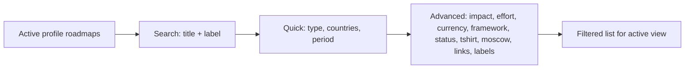

# Product Documentation

| Field | Value |
|-------|-------|
| **Product** | Product Management Prioritization Tool |
| **Version** | 2.0.0 |
| **Document owner** | Product Team |
| **Last audited** | 2026-05-28 |
| **Implementation baseline** | `APP_ASSET_VERSION` = `20260528-ui196` |

---

## 1. Product overview

The **Product Management Prioritization Tool** is a browser-based workspace for product teams to capture initiatives, score priority with **RICE**, classify delivery intent with **MoSCoW**, estimate value through **financial frameworks**, and communicate plans through **Table**, **Board**, **MoSCoW**, **Map**, **RACI**, and **KANO** views.

The application is a **static single-page app** (HTML, layered CSS, vanilla JavaScript) deployable to **Vercel**. When configured, workspace data syncs to **MongoDB Atlas** via serverless `/api` routes; the browser keeps a **local cache** and supports **JSON/CSV export** for backup and portability.

| | |
|---|---|
| **Production URL** | [pm-prioritization-tool-six.vercel.app](https://pm-prioritization-tool-six.vercel.app) |
| **Repository** | [github.com/RifqiMT/pm-prioritization-tool](https://github.com/RifqiMT/pm-prioritization-tool) |

---

## 2. Product benefits

| Benefit | How the product delivers it |
|---------|------------------------------|
| **Explainable prioritization** | RICE inputs, formula, and computed score appear together in tooltips and sortable columns. |
| **Portfolio separation** | Multiple **profiles** (teams, products, owners) with optional password protection. |
| **Financial planning lenses** | Six frameworks without accounting-grade complexity. |
| **Meeting-ready views** | Table for analysis, Board for workflow, MoSCoW for scope negotiation, Map for geography, RACI for accountability, KANO for value classification. |
| **Data ownership** | Cloud sync when enabled; export anytime; merge import for spreadsheets. |
| **Works on any device** | Desktop above **1400px**; unified compact UI at **≤1400px** on tablets and phones. |
| **Low operational cost** | No mandatory backend for local use; optional MongoDB on Vercel. |

---

## 3. Feature catalog

### 3.1 Profiles and security

- Create, edit, view, delete profiles (name, optional team).
- Search in profiles panel; **profile picker** on compact layouts (same row as privileged workspace toggle when applicable — see [GUARDRAILS.md](GUARDRAILS.md) §7).
- Optional **PBKDF2 password** per profile (`src/modules/profile-security.js`).
- **Session unlock** (`sessionStorage`); cleared on tab close or refresh.
- Locked profiles show unlock banner; portfolio views empty until unlock.
- **Demo profile** (`Test`) is read-only when active.

### 3.2 Roadmaps

- Full CRUD via modal (create, edit, read-only view) with section navigation (Roadmap, RICE, MoSCoW, KANO, Meta, RACI, Financial, Details).
- **RICE** with validation (`src/rice.js`).
- **Rich-text descriptions** on **Description**, optional **Note**, and all four RICE description fields — **six surfaces** (`RichTextEditor`); sanitized HTML; view mode hides toolbar; CSV strips to plain text.
- Metadata: type, status, MoSCoW, **multi-quarter periods** (`roadmapPeriods[]` with per-quarter status), optional **deadline** (`roadmapDeadline` as `YYYY-MM-DD`), countries (including **EU** region shortcut), t-shirt size, **labels**, **links**, **tasks**, **note**.
- **Labels** — optional multi-value tags (multi-word allowed); normalized on save and cloud sync (`normalizeRoadmapLabels`).
- **Links** — optional named hyperlinks (`{ label, url }`); http/https only; legacy import shapes (`name`, `href`, string URLs) normalized on load.
- **Tasks** — optional checklist items with name + status (uses `roadmapStatusList` values); persisted as `tasks[]`; CSV column `roadmapTasks` (JSON).
- **Bulk delete** in table (toolbar on desktop; floating **selection bar** on compact).
- **Bulk duplicate** and **bulk move** to another profile when privileged workspace mode is active (see [GUARDRAILS.md](GUARDRAILS.md) §7) — `roadmapBulkTransferModal`.
- Stable **roadmap ID** and metadata in modal footer (collapsible on compact).

### 3.3 Financial frameworks

| Framework | Purpose |
|-----------|---------|
| **custom** | Direct monetary amount |
| **clv** | Customer lifetime value delta vs baseline |
| **nps** | Retention, expansion, referral, program cost |
| **risk** | Expected loss reduction net of mitigation |
| **headcount** | FTE time saved × loaded cost |
| **operational** | Unit cost and cycle-time savings |

Computed in `computeFrameworkFinancialImpact()` (`src/app.js`). Table shows a **Framework** icon column; filters support framework.

### 3.4 Filters

Organized in the portfolio filters drawer:

| Tier | Fields |
|------|--------|
| **Search** | Title (autocomplete), Label (autocomplete) |
| **Quick** | Roadmap type, Countries (multi-select + EU), Roadmap period |
| **Advanced** | Impact, Effort, Currency, Framework, Status, T-shirt, MoSCoW, Links (any / with / without), Labels (any / with / without) |

`applyFilters()` in `src/app.js` intersects all active criteria. Active count shown in filters badge; **Reset** clears filters.

### 3.5 Planning views

| View | Desktop (>1400px) | Compact (≤1400px) |
|------|-------------------|---------------------|
| **Table** | Sortable grid; semantic column classes; bulk delete in toolbar | Card list with optional **group by**; FAB; selection bar |
| **Board** | Horizontal status columns; drag-and-drop | Single-column stack; **Move to** status; curved cards |
| **MoSCoW** | 2×2 grid; headers show **Must Have**, **Should Have**, **Could Have**, **Won't Have** with descriptions on one row | **Jump to quadrant** nav (2×2 pills); single-column quadrants |
| **Map** | Leaflet choropleth | Metric pills (count, RICE, avg RICE, EUR, avg EUR) |
| **RACI** | Matrix: Responsible, Accountable, Consulted, Informed | Business/Tech domain filter; tooltips on names; compact card stack |
| **KANO** | Functionality × satisfaction portfolio map | Positioned vs not-positioned toggle; category legend; drag-and-drop reposition on desktop |
| **Gantt** | ISO-week timeline; bars from `roadmapPeriods[]`; deadline marker | Zoom Monthly / Standard / Wide; Jump to today; sticky header |
| **Fullscreen** | Per-view expand | Body host; compact layouts preserved |

### 3.6 Table compact cards (≤1400px)

When `html.is-compact-layout` and table view:

- Roadmaps render as **cards** instead of a horizontal grid (`table-compact-cards.css`).
- **Group by**: none, status, MoSCoW, t-shirt, framework, type, currency, owner profile name (when workspace-wide mode active — see [GUARDRAILS.md](GUARDRAILS.md) §7).
- Owner attribution stripe on cards when workspace-wide mode is on.

### 3.7 Data transfer

- **Export** JSON or CSV; password verification for protected profiles.
- **Import** merge JSON/CSV into existing workspace.
- Shared modal design (`export-modals-modern.css`).

### 3.8 Exchange rates

- Refresh FX to EUR (`src/modules/exchange-rates.js`).
- EUR in table; financial map metrics; profile currency breakdown with EUR equivalents.

### 3.9 Cloud storage (optional)

- `AppStorage` (`src/modules/storage.js`): load/save workspace to MongoDB via `/api/state`.
- Header status, Cloud modal (connect, pull, push, diagnostics); debounced sync (250ms) with **immediate flush** after roadmap save.
- Background pull skipped while local edits are pending or newer than last applied remote snapshot (prevents overwriting labels/links).
- Server normalizes labels, links, tasks, RACI, KANO axes, and note on every MongoDB write (`api/_lib/roadmap-metadata.js`).
- Legacy JSON keys (`profile.projects`, `projectsView`, `projectType`, `projectStatus`, `projectPeriod`) migrate to roadmap equivalents on load; saves write only canonical keys.
- Merge on load by document `updatedAt` and profile-count heuristics; local cache under `rice_prioritizer_v1`.

### 3.10 Site chrome

- **Header**: title, storage status, export/import, FX, cloud, compact actions menu.
- **Footer**: year, maintainer, LinkedIn, website, **GitHub repo**, **prioritization article** (`app-footer.css`).

---

## 4. Core business logic

### 4.1 RICE prioritization

```
confidenceDecimal = confidenceValue > 1 ? confidenceValue / 100 : confidenceValue
riceScore = (reachValue × impactValue × confidenceDecimal) ÷ effortValue
```

| Input | Rule |
|-------|------|
| Reach | Non-negative integer |
| Impact, Effort | 1–5 |
| Confidence | 0–100 (percent) or 0–1 decimal |
| Effort ≤ 0 | Score = 0 |

Implementation: `src/rice.js` → `calculateRiceScore`, `validateRoadmapInput`.

### 4.2 Filtering pipeline



### 4.3 Board ordering

- **RICE sort on**: cards sorted by score within each status column.
- **RICE sort off**: manual order in `profile.boardOrder[status]`.
- Compact: change status via **Move to** dropdown on cards.

### 4.4 MoSCoW

- Stored values: `Must have`, `Should have`, `Could have`, `Won't have` (`moscowList`).
- Display headers: **Must Have**, **Should Have**, **Could Have**, **Won't Have** (`moscowDisplayNames`).
- Compact: quadrant navigator + scroll sync (`syncMoscowCompactNav`, `IntersectionObserver`).
- Drag-and-drop between quadrants when portfolio is unlocked.

### 4.5 Map aggregation

| `mapMetric` | Meaning |
|-----------|---------|
| `roadmaps` | Roadmap count per country |
| `rice` | Sum of RICE per country |
| `riceAvg` | Average RICE per country |
| `financial` | Sum of financial impact (EUR) per country |
| `financialAvg` | Average financial impact (EUR) per country |

### 4.6 RACI accountability

- Each roadmap stores `raci` with four arrays: `responsible`, `accountable`, `consulted`, `informed`.
- Each entry: `{ name, domain }` where `domain` is `Business` or `Tech`.
- **RACI view** (`renderRaciMatrix`): desktop shows a five-column matrix; compact shows one card per roadmap.
- Workspace preference `raciMatrixDomain` filters which domain’s names appear in the matrix.
- Normalized on load/save via `normalizeRoadmapRaci` (client and `api/_lib/roadmap-metadata.js`).

### 4.7 KANO portfolio classification

- Axes: `kanoFunctionality` and `kanoSatisfaction` (integers 1–5, or null if unset).
- Level labels and category legend defined in `constants.js` (`kanoFunctionalityLevels`, `kanoSatisfactionLevels`, `kanoCategoryLegend`).
- **KANO view** (`renderKanoPortfolioMatrix`): **Positioned** panel shows matrix + category grouping; **Not positioned** lists roadmaps missing either axis.
- Desktop supports drag-and-drop between matrix cells to update scores; compact uses per-card score controls.
- Workspace preference `kanoPortfolioPanel` persists active sub-panel (`positioned` | `unpositioned`).

### 4.8 BYOK API keys (optional)

- Module: `src/modules/byok-api-keys.js` (`ByokApiKeys` global).
- Providers: **Groq** (LLM) and **Tavily** (search/extract).
- Storage: encrypted in `localStorage` keys `pm_byok_v1` + `pm_byok_device_salt_v1` — **excluded** from workspace export and MongoDB.
- Validation: serverless routes `api/byok/validate-groq.js` and `validate-tavily.js` using `api/_lib/byok-validate.js`.
- UI: header **API keys** button with status dot; modal with per-provider 3-step workflow (paste → validate → save).

### 4.9 LLM roadmap analysis (optional)

- Module: `src/modules/roadmap-llm-summary.js` (`RoadmapLlmSummary` global).
- Trigger: **Generate LLM analysis** in roadmap modal Summary section (requires both BYOK keys).
- Pipeline: build context from roadmap fields → Tavily extract on links (max 3) + optional search → Groq synthesis into **three paragraphs**.
- Tones: **Professional** (default) and **Simplified** (toggle after generation).
- Output is **session-only** — not stored on `roadmap` entity or in cloud workspace document.

### 4.10 5 Why Framework (optional)

- Module: `src/modules/roadmap-5why-framework.js` (`RoadmapFiveWhyFramework` global).
- Trigger: **Ask WHY 1** (then **Ask WHY 2** … **Ask WHY 5**) in roadmap modal **5 Why Framework** section — **view-only** mode only.
- Pipeline: build context from saved roadmap fields → Tavily link extract + search per level → Groq generates a **single plain-English question** per WHY level (no answers).
- Lenses: five DMAIC-aligned levels (`WHY_LEVEL_LENS`) from “why on the roadmap” through “root reason underneath.”
- Controls: **Reset chain** clears session output; generate button disables when all five levels complete.
- Output is **session-only** — independent from LLM Summary (§4.9); shares BYOK keys only.
- Styles: `main.css` `.roadmap-fivewhy-*` rules in roadmap modal.

---

## 5. Feature logic across the app

For a **collaborative, cross-feature** explanation of how each capability works — including shared rules, validation, and constraints — see **[FEATURE_LOGIC_AND_CONSTRAINTS.md](FEATURE_LOGIC_AND_CONSTRAINTS.md)**. Use it alongside [GUARDRAILS.md](GUARDRAILS.md) (hard limits) and [BUSINESS_GUIDELINES.md](BUSINESS_GUIDELINES.md) (planning rubrics).

---

## 6. Technical architecture (summary)

See [ARCHITECTURE.md](ARCHITECTURE.md).

| Layer | Technology |
|-------|------------|
| UI | `index.html`, **40** layered CSS files (see [TECH_GUIDELINES.md](TECH_GUIDELINES.md) §3.1) |
| Logic | `src/app.js` (~24k lines), `src/rice.js`, `src/constants.js`, `src/utils.js` |
| Modules | `storage`, `profile-security`, `exchange-rates`, `fullscreen`, `overlay-manager`, `description-format`, `rich-text-editor`, `board-drag`, `board-card-interaction`, `byok-api-keys`, `roadmap-llm-summary`, `roadmap-5why-framework`, `roadmap-periods`, `gantt-view`, `export-payload`; dev seed: `dev-seed-workspace.js` (localhost only) |
| API | `api/health.js`, `api/config.js`, `api/state.js`, `api/byok/validate-*.js`, `api/_lib/*` (auth, mongo, roadmap-metadata, export-payload, byok-validate) |
| Database | MongoDB Atlas (optional) |
| Map | Leaflet 1.9.4 (CDN) |

### Layout classes (`initCompactLayoutClass()` in `src/app.js`)

| Class | When |
|-------|------|
| `html.is-compact-layout` | Viewport width ≤ **1400px** |
| `html.is-phone-layout` | Same threshold (unified phone/tablet UI) |
| `html.is-desktop-layout` | Width > **1400px** |
| `html.is-super-admin-mode` | Privileged workspace mode active — see [GUARDRAILS.md](GUARDRAILS.md) §7 |

---

## 7. Business guidelines (summary)

See [BUSINESS_GUIDELINES.md](BUSINESS_GUIDELINES.md).

- Use a **consistent RICE rubric** before comparing scores across teams.
- Treat financial outputs as **planning estimates**, not audited financial statements.
- MoSCoW is for **scope negotiation**; RICE for **relative priority**.
- **Export JSON** before major imports or browser data clears.
- Unlock protected profiles before export or use the export verification dialog.

---

## 8. Technical guidelines (summary)

See [TECH_GUIDELINES.md](TECH_GUIDELINES.md).

- Classic scripts (no bundler); globals from loaded script order in `index.html`.
- State persisted under `STORAGE_KEY` (`rice_prioritizer_v1`) plus optional cloud document.
- Bump `APP_ASSET_VERSION` when shipping UI changes.
- `OverlayManager` coordinates stacked modals and filter dropdowns.
- Do not log passwords or export payloads.

---

## 9. Design system (summary)

See [DESIGN_GUIDELINES.md](DESIGN_GUIDELINES.md).

- **Warm professional** palette: cream surfaces (`#fffdf8`), maroon text (`#3f0f19`), red accent (`#b91c1c`).
- **Icon-first** navigation on compact widths.
- **Touch targets** ≥ 44px on primary compact controls.
- Status, MoSCoW, and framework colors consistent across table, board, and pills.
- Board/MoSCoW cards: **12px** radius on compact and desktop (aligned shells).

---

## 10. Limitations and guardrails

See [GUARDRAILS.md](GUARDRAILS.md).

- No multi-user real-time collaboration.
- No server-side RBAC beyond profile passwords.
- FX rates may be stale if not refreshed.
- Very large portfolios may slow client-side table render.
- Privileged cross-profile workspace mode: **§7 only** in guardrails.

---

## 11. Related documents

| Document | Purpose |
|----------|---------|
| [FEATURE_LOGIC_AND_CONSTRAINTS.md](FEATURE_LOGIC_AND_CONSTRAINTS.md) | Cross-feature logic, rules, and constraints |
| [PRD.md](PRD.md) | Formal requirements |
| [USER_PERSONAS.md](USER_PERSONAS.md) | Personas |
| [USER_STORIES.md](USER_STORIES.md) | Stories and acceptance criteria |
| [VARIABLES.md](VARIABLES.md) | Variable dictionary and relationship charts |
| [METRICS_AND_OKRS.md](METRICS_AND_OKRS.md) | Metrics and OKRs |
| [TRACEABILITY_MATRIX.md](TRACEABILITY_MATRIX.md) | Requirements → code |
| [CHANGELOG.md](CHANGELOG.md) | Release history |
| [DEPLOYMENT.md](DEPLOYMENT.md) | Vercel + MongoDB |
| [PRODUCT_DOCUMENTATION_STANDARD.md](PRODUCT_DOCUMENTATION_STANDARD.md) | Documentation maintenance standard |

---

## 12. Maintainer

**Developed, managed, and maintained by Rifqi Tjahyono**

- LinkedIn: [rifqi-tjahjono](https://www.linkedin.com/in/rifqi-tjahjono/)  
- Website: [rifqi-tjahyono.com](https://rifqi-tjahyono.com/)  
- GitHub: [RifqiMT/pm-prioritization-tool](https://github.com/RifqiMT/pm-prioritization-tool)  
- Article: [Prioritization article](https://rifqi-tjahyono.com/%f0%9f%93%8a-effort-impact-confusion-to-clear-cut-priorities-replace-tab-hopping-with-visual-roadmap-sanity-%f0%9f%a7%ad%e2%9c%a8/)
