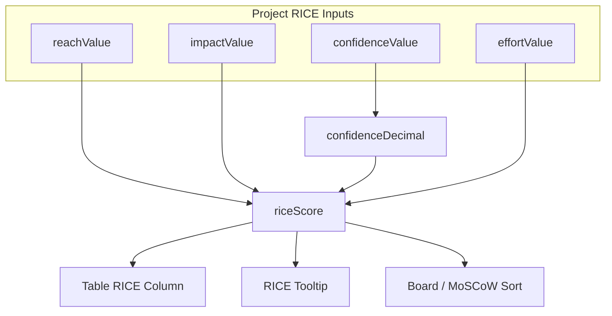
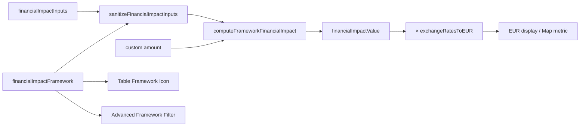
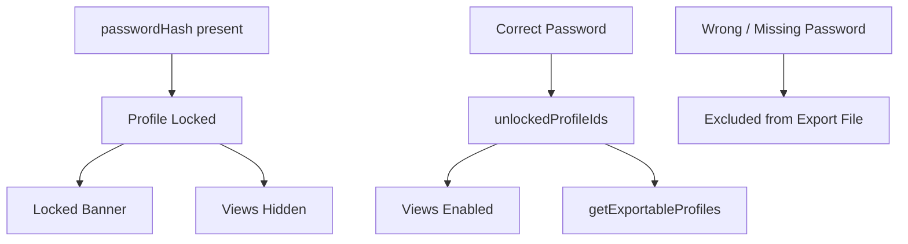
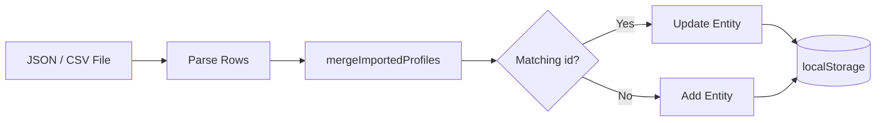
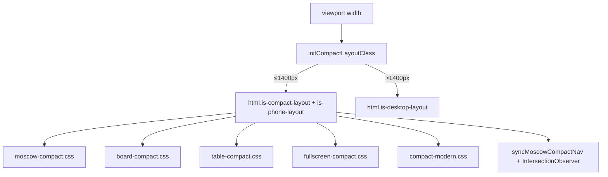

# Variables Documentation

**Purpose:** Authoritative dictionary of application variables — technical name, friendly name, definition, formula, UI location, and examples.  
**Audience:** Product, engineering, QA, analytics.  
**Last audited:** 2026-05-27

---

## How to read this document

Each variable includes:

- **Technical name** — key in code or storage  
- **Friendly name** — label for workshops and PRDs  
- **Definition** — what it represents  
- **Formula / logic** — how it is derived, if applicable  
- **App location** — where it appears or is edited  
- **Example** — realistic sample value  

---

## 1. Application state (`state` in `src/app.js`)

Persisted to `localStorage` under `rice_prioritizer_v1` unless noted.

| Technical Name | Friendly Name | Definition | Formula / Logic | App Location | Example |
|----------------|---------------|------------|-----------------|--------------|---------|
| `profiles` | Profile Collection | All portfolio containers and their projects. | Array of profile objects. | Global state | `[{ id: "profile_abc", name: "Growth", projects: [...] }]` |
| `activeProfileId` | Active Profile | ID of portfolio currently selected for workspace views. | String; must match a profile `id`. | Profiles panel + portfolio header | `"profile_abc"` |
| `sortField` | Table Sort Column | Active sort key for table view. | Enum used by `sortProjects`. | Table view | `"riceScore"` |
| `sortDirection` | Sort Direction | Ascending or descending table sort. | `"asc"` \| `"desc"`. | Table view | `"desc"` |
| `projectsView` | Active Planning View | Which workspace tab is visible. | `table` \| `board` \| `moscow` \| `map`. | View tabs | `"board"` |
| `scrumBoardSortByRice` | Board RICE Sort | When true, board cards sorted by RICE per column. | Boolean; persisted. | Board toolbar toggle | `true` |
| `moscowSortByRice` | MoSCoW RICE Sort | When true, cards in each MoSCoW quadrant sorted by RICE. | Boolean; persisted. | MoSCoW toolbar toggle | `true` |
| `mapMetric` | Map Aggregation Metric | What the choropleth represents. | `projects` \| `rice` \| `riceAvg` \| `financial` \| `financialAvg` | Map metric picker | `"financial"` |
| `exchangeRatesToEUR` | FX Rates to EUR | Map of currency code → EUR multiplier. | `amountEUR = amount × rate`. | FX refresh; table/map EUR | `{ "USD": 0.92, "IDR": 0.000058 }` |
| `exchangeRatesDate` | FX Rates Date | ISO timestamp of last rate fetch. | Set on refresh. | Header FX footnote | `"2026-05-26T10:00:00.000Z"` |
| `exchangeRatesLastSource` | FX Source | Whether rates were manual or auto. | `manual` \| `auto`. | Internal | `"auto"` |

### Session-only (not in `saveState`)

| Technical Name | Friendly Name | Definition | Formula / Logic | App Location | Example |
|----------------|---------------|------------|-----------------|--------------|---------|
| `unlockedProfileIds` | Unlocked Profiles (session) | Set of profile IDs unlocked with password this tab. | Cleared on refresh; stored in `sessionStorage`. | Lock banner, export gate | `Set(["profile_abc"])` |
| `editingProjectId` | Editing Project | Project id open in modal for edit. | `null` when creating. | Project modal | `"project_xyz"` |
| `activeTooltipWrap` | Active Tooltip Host | DOM wrapper owning the visible tooltip. | Enforces one tooltip policy. | Table/cards/modal | `HTMLElement` |
| `pendingUnlockAction` | Pending Unlock Action | Unlock intent queued when user triggers view/edit on a locked profile. | Cleared after successful unlock. | Profile unlock gating | `{ type: "edit" \| "view" \| "activate", profileId?: string }` |
| `pendingExportFormat` | Pending Export Format | Export format chosen before verifying protected profiles. | Cleared after export completes. | Export unlock modal | `"json" \| "csv"` |
| `profilesFilterQuery` | Profiles Panel Search Query | Search query for profiles panel (name/team). | Not persisted; resets on refresh. | Profiles panel | `"Growth"` |

---

## 2. Profile entity

| Technical Name | Friendly Name | Definition | Formula / Logic | App Location | Example |
|----------------|---------------|------------|-----------------|--------------|---------|
| `id` | Profile ID | Stable unique identifier. | `generateId("profile")`. | Storage, import merge | `"profile_1745..."` |
| `name` | Profile Name | Display name of portfolio. | Required on create. | Profiles panel, header | `"Rifqi Tjahyono"` |
| `team` | Team | Optional organizational label. | Free text. | Profile card, export | `"Growth"` |
| `createdAt` | Created At | Profile creation timestamp. | ISO 8601. | Storage | `"2026-01-15T08:00:00.000Z"` |
| `projects` | Projects | Array of project objects. | Owned by profile. | All views | `[...]` |
| `boardOrder` | Board Order | Per-status ordered project id lists. | Used when RICE sort off. | Board drag-drop | `{ "In Progress": ["p1","p2"] }` |
| `passwordSalt` | Password Salt | Salt for PBKDF2 hash. | From `ProfileSecurity.generateSalt()`. | Never shown in UI | `"a1b2c3..."` |
| `passwordHash` | Password Hash | PBKDF2 hash with prefix `v1:`. | Verified on unlock/export. | Never shown | `"v1:9f3a..."` |

---

## 3. Project entity — RICE inputs

| Technical Name | Friendly Name | Definition | Formula / Logic | App Location | Example |
|----------------|---------------|------------|-----------------|--------------|---------|
| `reachValue` | Reach | People/events affected in the planning window. | **R** in RICE; integer ≥ 0. | Project modal, table | `5000` |
| `reachDescription` | Reach Notes | Qualitative reach context. | Optional text. | Project modal | `"Monthly active users"` |
| `impactValue` | Impact | Impact per reach unit. | **I** in RICE; 1–5. | Project modal | `3` |
| `impactDescription` | Impact Notes | Qualitative impact context. | Optional text. | Project modal | `"Revenue per user"` |
| `confidenceValue` | Confidence | Confidence in estimates (%). | **C** in RICE; 0–100. | Project modal | `80` |
| `confidenceDescription` | Confidence Notes | Evidence for confidence. | Optional text. | Project modal | `"Beta survey n=200"` |
| `effortValue` | Effort | Relative implementation cost. | **E** in RICE; 1–5 divisor. | Project modal | `2` |
| `effortDescription` | Effort Notes | Qualitative effort context. | Optional text. | Project modal | `"Two squads, 1 quarter"` |
| `riceScore` | RICE Score | Computed priority score. | See §4.1 | Table, tooltips, board sort | `6000` |

---

## 4. Formulas

### 4.1 RICE score

```
confidenceDecimal = confidenceValue > 1 ? confidenceValue / 100 : confidenceValue
riceScore = (reachValue × impactValue × confidenceDecimal) ÷ effortValue
```

If `effortValue ≤ 0` → score `0`.  
**Implementation:** `src/rice.js` → `calculateRiceScore`.

### 4.2 EUR display (reporting)

```
financialImpactEUR = financialImpactValue × exchangeRatesToEUR[currency]
```

If rate missing, EUR display may be omitted or stale per [GUARDRAILS.md](GUARDRAILS.md).

**Profile currency totals (original-currency breakdown):**
- For each currency total card (non-EUR), the app computes:

```
currencyTotalEUR = currencyTotalOriginal × exchangeRatesToEUR[currency]
```

- If `exchangeRatesToEUR[currency]` is missing or non-finite, the UI shows “EUR conversion unavailable” (no implied precision).

### 4.3 Financial frameworks (summary)

| Framework | Friendly Name | Output |
|-----------|---------------|--------|
| `custom` | Custom amount | User-entered `financialImpactValue` |
| `clv` | Customer lifetime value | Δ net CLV × customers (see `computeFrameworkFinancialImpact`) |
| `nps` | NPS impact | Retention + expansion + referral − cost (basis toggle) |
| `risk` | Risk reduction | Expected loss before − after − mitigation |
| `headcount` | Headcount avoidance | Avoided FTE × annual loaded cost |
| `operational` | Operational savings | Unit cost delta + cycle-time labor savings |

Full input field whitelists: `sanitizeFinancialImpactInputs` in `src/app.js`.

---

## 5. Project entity — metadata & financial

| Technical Name | Friendly Name | Definition | Formula / Logic | App Location | Example |
|----------------|---------------|------------|-----------------|--------------|---------|
| `id` | Project ID | Stable project identifier. | `generateId("project")`. | Modal footer, merge | `"project_1745..."` |
| `title` | Project Title | Short initiative name. | Required. | Table, cards, modal | `"EU GDPR compliance"` |
| `description` | Description | Scope/outcome narrative. | Optional; in card tooltip. | Project modal | `"Enable consent flows..."` |
| `financialImpactFramework` | Financial Framework | Active value model. | Normalized enum. | Modal, table Framework column | `"operational"` |
| `financialImpactInputs` | Framework Inputs | Key-value inputs per framework. | Sanitized on save/switch. | Project modal sections | `{ opAnnualVolume: 10000 }` |
| `financialImpactValue` | Financial Impact | Computed or manual amount. | From framework or custom. | Table, map | `166500` |
| `financialImpactCurrency` | Currency | ISO-like currency code. | Required if value non-zero. | Project modal | `"EUR"` |
| `projectStatus` | Project Status | Workflow state. | One of `projectStatusList`. | Table, board column | `"In Progress"` |
| `projectType` | Project Type | Initiative category. | Team-defined list. | Table Type column | `"Regulatory"` |
| `moscowCategory` | MoSCoW Category | Delivery priority class. | One of `moscowList`. | MoSCoW view | `"Must have"` |
| `tshirtSize` | T-Shirt Size | Rough sizing. | XS–XL. | Table | `"M"` |
| `projectPeriod` | Project Period | Planning quarter. | `YYYY-Q[1-4]`. | Filters, table | `"2026-Q2"` |
| `countries` | Countries | Geo tags (normalized names). | Array; drives map. | Project modal, map | `["Germany","France"]` |
| `createdAt` | Created At | Creation timestamp. | ISO 8601. | Modal footer | `"2026-03-01T..."` |
| `modifiedAt` | Last Modified | Last edit timestamp. | ISO 8601. | Modal footer | `"2026-05-20T..."` |

---

## 6. Filter variables (UI → `applyFilters`)

| Technical Name | Friendly Name | Definition | App Location | Example |
|----------------|---------------|------------|--------------|---------|
| `filterTitle` | Title Filter | Substring match on project title. | Filters drawer | `"payment"` |
| `filterType` | Type Filter | Match `projectType`. | Filters drawer | `"Platform"` |
| `filterCountries` | Countries Filter | Project must include selected countries. | Filters drawer | `["Indonesia"]` |
| `filterProjectPeriod` | Period Filter | Match `projectPeriod`. | Filters drawer | `"2026-Q1"` |
| `filterFinancialFramework` | Framework Filter | Match normalized framework. | Advanced filters | `"headcount"` |
| `filterStatus` | Status Filter | Match `projectStatus`. | Advanced filters | `"In Progress"` |
| `filterMoscow` | MoSCoW Filter | Match `moscowCategory`. | Advanced filters | `"Should have"` |

---

## 7. Constants (`src/constants.js`)

| Technical Name | Friendly Name | Definition | Example |
|----------------|---------------|------------|---------|
| `STORAGE_KEY` | Storage Key | localStorage key for app state. | `"rice_prioritizer_v1"` |
| `projectStatusList` | Status Enum | Allowed status values. | 5 statuses |
| `moscowList` | MoSCoW Enum | Allowed MoSCoW values. | 4 categories |
| `tshirtSizeList` | T-Shirt Enum | Allowed sizes. | XS–XL |
| `currencyList` | Currency List | Selectable currencies. | EUR, USD, IDR, … |
| `LEGACY_WORKSPACE_FIELDS` | Legacy Workspace Keys | Deprecated workspace JSON keys stripped on load/import/persist. | `["boardHiddenStatuses"]` |
| `countryList` | Country List | Normalized country names for geo. | `"Germany"` |
| `COUNTRY_OPTION_EU` | EU Region Option | Pseudo-value `EU` in target-country selects; expands to all EU members on selection. | `"EU"` |
| `EU_MEMBER_COUNTRIES` | EU Member States | 27 canonical `countryList` names filled when `EU` is chosen. | `["Germany", "France", …]` |
| `CURRENCY_SYMBOLS` | Currency Symbol Map | Display symbol for each supported currency code. | `{ EUR: "€", GBP: "£", IDR: "Rp", ... }` |

---

## 8. Variable relationship charts

### 8.1 RICE and display



### 8.2 Financial framework pipeline



### 8.8 Profile currency totals (original currency → EUR)

```mermaid
flowchart TD
  P[profile.projects] --> SUM[buildProfileViewCurrencyData totals per currency]
  SUM --> CARD[Currency total cards (original currency)]
  SUM -->|non-EUR| ENSURE[ExchangeRates.ensure]
  ENSURE --> CONV[convertToEUR(total, currency)]
  CONV --> EUR2[EUR equivalent display]
  CONV -->|missing rate| FALLBACK["EUR conversion unavailable"]
```

### 8.3 Profile lock and export



### 8.4 Import merge



### 8.5 Map aggregation metric selection

```mermaid
flowchart TD
  MM[mapMetric (persisted)] --> RENDER[renderProjectsMap]
  RENDER -->|projects| COUNT[countByCode]
  RENDER -->|rice| RICE[riceByCode]
  RENDER -->|financial| FIN[financial EUR totals per code]
  RENDER --> LEGEND[map legend text/scale]
```

### 8.6 Compact layout classes



---

## 9. Layout, DOM, and build constants

| Technical Name | Friendly Name | Definition | Formula / Logic | App Location | Example |
|----------------|---------------|------------|-----------------|--------------|---------|
| `APP_ASSET_VERSION` | Asset Cache Version | Query-string cache buster for CSS/JS in `index.html`. | Bump on UI releases. | `src/constants.js`, `index.html` | `"20260528-ui119"` |
| `COMPACT_LAYOUT_MAX_WIDTH_PX` | Compact Breakpoint (px) | Max viewport width for phone/tablet UI. | Constant in `constants.js`. | `src/constants.js` | `1400` |
| `is-compact-layout` | Compact Layout Class | Viewport ≤1400px; enables compact CSS. | Set on `<html>` by `initCompactLayoutClass()`. | Global layout | class present |
| `is-phone-layout` | Phone Layout Class | Same threshold as compact (unified phone UI). | Set together with compact class. | Global layout | class present |
| `is-desktop-layout` | Desktop Layout Class | Viewport >1400px. | Mutually exclusive with compact. | Global layout | class present |
| `moscowCompactNav` | MoSCoW Compact Navigator | 2×2 pill bar to jump between quadrants on compact. | `syncMoscowCompactNav()` updates active pill. | MoSCoW view (compact) | DOM `#moscowCompactNav` |
| `portfolioSelectionBar` | Portfolio Selection Bar | Floating bar for bulk delete when rows selected on compact table. | Shown when `selectedProjectIds` non-empty. | Table view (compact) | DOM element |
| `view-in-fullscreen-host` | Fullscreen Host Class | Body class when a view is fullscreen. | `fullscreen.js` + `fullscreen-compact.css`. | Fullscreen | class on `body` |
| `PRODUCTION_APP_ORIGIN` | Production URL | Canonical deployed origin for links/docs. | Constant string. | `src/constants.js` | `https://pm-prioritization-tool-six.vercel.app` |

### Cloud storage metadata (`_storageMeta` on workspace)

| Technical Name | Friendly Name | Definition | Formula / Logic | App Location | Example |
|----------------|---------------|------------|-----------------|--------------|---------|
| `_storageMeta.updatedAt` | Workspace Updated At | ISO timestamp for merge conflict resolution. | Newer local vs remote wins on load. | `storage.js` | `"2026-05-26T12:00:00.000Z"` |
| `_storageMeta.source` | Last Save Source | Whether last write was local or cloud. | Set on save paths. | Cloud modal / debug | `"cloud"` |

---

## 10. Related documents

- [PRD.md](PRD.md) — requirements  
- [BUSINESS_GUIDELINES.md](BUSINESS_GUIDELINES.md) — rubrics  
- [ARCHITECTURE.md](ARCHITECTURE.md) — data flow  
