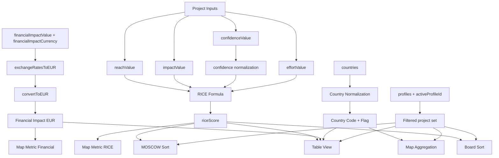

# Variables Documentation

## Purpose

This document provides an exhaustive variable and data-field catalog for the app, including definitions, formulas, app location, and examples.

---

## 1) Application State Variables

| Variable | Friendly Name | Definition | Formula / Logic | App Location | Example |
|---|---|---|---|---|---|
| `profiles` | Profile Collection | Array of all profile objects in local state. | N/A | `src/app.js` (`state`) | `[{ id: "profile_x", name: "Default Profile", ... }]` |
| `activeProfileId` | Active Profile Pointer | ID of currently selected profile. | N/A | `src/app.js` (`state`) | `"profile_abc123"` |
| `sortField` | Table Sort Field | Current field used for table sorting. | N/A | `src/app.js` (`state`) | `"createdAt"` |
| `sortDirection` | Table Sort Direction | Current sort direction. | `asc` or `desc` | `src/app.js` (`state`) | `"desc"` |
| `projectsView` | Active View | Current visible project view. | One of `table`, `board`, `moscow`, `map` | `src/app.js` (`state`) | `"table"` |
| `scrumBoardSortByRice` | Board Auto-Sort Toggle | Whether board cards auto-sort by RICE. | Boolean | `src/app.js` (`state`) | `true` |
| `moscowSortByRice` | MOSCOW Auto-Sort Toggle | Whether MOSCOW cards auto-sort by RICE. | Boolean | `src/app.js` (`state`) | `true` |
| `mapMetric` | Map Metric Selector | Metric displayed in map choropleth. | One of `projects`, `rice`, `financial` | `src/app.js` (`state`) | `"financial"` |
| `exchangeRatesToEUR` | Currency-to-EUR Rate Dictionary | Map of currency code to `EUR per 1 unit` of that currency. | From ETL sources + fallback merge | `src/app.js`, `src/modules/exchange-rates.js` | `{ USD: 0.92, IDR: 0.000057 }` |
| `exchangeRatesDate` | Exchange Rate Date | Current effective rates date (Berlin timezone day). | `YYYY-MM-DD` | `src/modules/exchange-rates.js` | `"2026-04-14"` |
| `exchangeRatesLastSource` | Last Refresh Source | Indicates refresh trigger source. | `manual` or `auto` | `src/modules/exchange-rates.js` | `"manual"` |
| `editingProjectId` | Project Edit Cursor | Tracks project currently being edited. | N/A | `src/app.js` | `"project_456"` |
| `projectModalMode` | Project Modal Mode | Current project modal behavior mode. | `create` or `edit` | `src/app.js` | `"create"` |

---

## 2) Profile Object Variables

| Variable | Friendly Name | Definition | Formula / Logic | App Location | Example |
|---|---|---|---|---|---|
| `id` | Profile ID | Unique profile identifier. | `generateId("profile")` | `src/app.js` | `"profile_x8j2q9"` |
| `name` | Profile Name | Human-readable profile name. | Required text | `src/app.js` | `"Q3 Roadmap"` |
| `team` | Team Name | Optional team/owner label. | Optional text | `src/app.js` | `"Growth"` |
| `createdAt` | Profile Created Timestamp | ISO timestamp for profile creation. | `new Date().toISOString()` | `src/app.js` | `"2026-04-14T15:00:00.000Z"` |
| `projects` | Profile Projects | Project array scoped to the profile. | N/A | `src/app.js` | `[{...project}]` |
| `boardOrder` | Board Manual Order Map | Status-column order map when board auto-sort disabled. | Keyed by status | `src/app.js` | `{ "In Progress": ["p1","p2"] }` |
| `moscowOrder` | MOSCOW Manual Order Map | Quadrant order map when MOSCOW auto-sort disabled. | Keyed by category | `src/app.js` | `{ "Must have": ["p1"] }` |

---

## 3) Project Object Variables

| Variable | Friendly Name | Definition | Formula / Logic | App Location | Example |
|---|---|---|---|---|---|
| `id` | Project ID | Unique project identifier. | `generateId("project")` | `src/app.js` | `"project_4k92m1"` |
| `title` | Project Title | Primary project name. | Required text | `src/app.js` | `"Refund Data Extraction"` |
| `description` | Description | Optional long-form description. | Optional text | `src/app.js` | `"Automate refund ingestion."` |
| `reachDescription` | Reach Description | Notes for reach estimate. | Optional text | `src/app.js` | `"Users impacted by launch"` |
| `reachValue` | Reach Value | Reach input for RICE. | Integer `>=0` | `src/rice.js` | `100` |
| `impactDescription` | Impact Description | Notes for impact estimate. | Optional text | `src/app.js` | `"High value to users"` |
| `impactValue` | Impact Value | Impact input for RICE. | Integer `1..5` | `src/rice.js` | `3` |
| `confidenceDescription` | Confidence Description | Notes for confidence estimate. | Optional text | `src/app.js` | `"Validated with pilot"` |
| `confidenceValue` | Confidence Percentage | Confidence input for RICE. | Numeric `0..100` | `src/rice.js` | `80` |
| `effortDescription` | Effort Description | Notes for effort estimate. | Optional text | `src/app.js` | `"2 sprint effort"` |
| `effortValue` | Effort Value | Effort denominator in RICE. | Integer `1..5` | `src/rice.js` | `2` |
| `riceScore` | RICE Score | Computed prioritization score. | `(reach * impact * confidenceNorm) / effort` | `src/rice.js`, `src/app.js` | `120` |
| `financialImpactValue` | Financial Amount | Optional amount in original currency. | Number `>=0` | `src/app.js`, `src/rice.js` | `1500000` |
| `financialImpactCurrency` | Financial Currency | ISO currency code for amount. | Uppercase currency code | `src/app.js` | `"EUR"` |
| `projectType` | Project Type | Classification bucket. | Enum | `src/constants.js`, `src/app.js` | `"Improvement"` |
| `projectStatus` | Project Status | Delivery status classification. | Enum | `src/constants.js`, `src/app.js` | `"In Progress"` |
| `tshirtSize` | T-shirt Size | Relative sizing category. | Enum `XS..XL` | `src/constants.js`, `src/app.js` | `"M"` |
| `projectPeriod` | Project Period | Quarter period representation. | `YYYY-Q[1-4]` | `src/rice.js`, `src/app.js` | `"2026-Q3"` |
| `moscowCategory` | MOSCOW Category | Priority category. | Enum, default `"Could have"` | `src/constants.js`, `src/app.js` | `"Must have"` |
| `countries` | Target Countries | Country list for map aggregation. | Canonicalized on save/import | `src/app.js`, `src/constants.js` | `["Germany","Indonesia"]` |
| `createdAt` | Project Created Timestamp | ISO creation timestamp. | `new Date().toISOString()` | `src/app.js` | `"2026-04-14T15:30:00.000Z"` |
| `modifiedAt` | Project Modified Timestamp | ISO update timestamp. | Updated on edit | `src/app.js` | `"2026-04-14T16:20:00.000Z"` |

---

## 4) Formula Variables and Transformations

### 4.1 RICE Formula Variables

- `reach = Number(project.reachValue || 0)`
- `impact = Number(project.impactValue || 0)`
- `confidence = Number(project.confidenceValue || 0)`
- `effort = Number(project.effortValue || 0)`
- `confidenceNorm = confidence > 1 ? confidence / 100 : confidence`
- `riceScore = (reach * impact * confidenceNorm) / effort`

### 4.2 Exchange Rate Conversion Variables

- `exchangeRatesToEUR[currency]` = `EUR per 1 local currency`
- `amountEUR = amountLocal * exchangeRatesToEUR[currency]`
- UI preview rate line: `1 EUR = (1 / exchangeRatesToEUR[currency]) local currency` (2 decimals)

### 4.3 Financial Display Variables

- `formatFinancialShort(n)` returns:
  - `K` for thousand
  - `Mn` for million
  - `Bn` for billion
  - `Tn` for trillion

---

## 5) Global Constant Variables

| Variable | Friendly Name | Definition | App Location |
|---|---|---|---|
| `STORAGE_KEY` | Local Storage Key | Primary localStorage key for serialized state payload. | `src/constants.js` |
| `projectStatusList` | Status Catalog | Ordered status options. | `src/constants.js` |
| `projectStatusIcons` | Status Icon Metadata | Status icon and tooltip metadata. | `src/constants.js` |
| `tshirtSizeList` | Size Catalog | T-shirt options. | `src/constants.js` |
| `moscowList` | MOSCOW Catalog | MOSCOW category options. | `src/constants.js` |
| `moscowTooltips` | MOSCOW Tooltip Metadata | MOSCOW tooltip and grid descriptions. | `src/constants.js` |
| `projectTypeIcons` | Type Icon Metadata | Project type icon and tooltip metadata. | `src/constants.js` |
| `currencyList` | Currency Catalog | Supported currency dropdown list. | `src/constants.js` |
| `countryList` | Country Catalog | Canonical country list. | `src/constants.js` |
| `countryCodeByName` | Country-to-Code Map | Country display to ISO-2 mapping. | `src/constants.js` |
| `countryNameAliases` | Country Alias Map | Alternate country labels mapped to canonical names. | `src/constants.js` |

---

## 6) Variable Relationship Chart

---

## 7) Data Quality and Governance Notes

- All country values should pass canonical normalization before persistence and import merge.
- Financial conversions are deterministic against the currently loaded rates snapshot.
- RICE validation ensures denominator (`effortValue`) never reaches zero in valid data.
- Import merge behavior should preserve project IDs and avoid duplicate insertion.

