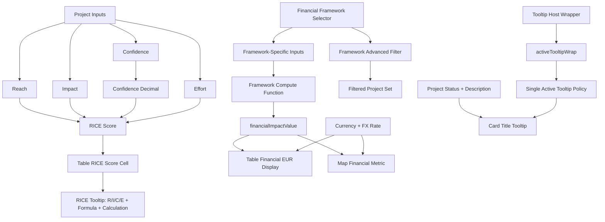

# Variables Documentation

This document catalogs critical application variables with professional definitions, formulas, locations, and examples.

## 1. State Variables

| Variable Name | Friendly Name | Definition | Formula / Logic | App Location | Example |
|---|---|---|---|---|---|
| `profiles` | Profile Collection | All portfolio containers in runtime state. | Array of profile objects. | `src/app.js` (`state`) | `[{ id: "profile_1", ... }]` |
| `activeProfileId` | Active Profile Pointer | Current profile context used for rendering and mutation. | Selected profile id. | `src/app.js` | `"profile_1"` |
| `sortField` | Table Sort Field | Current sortable column key. | String enum matched by `sortProjects`. | `src/app.js` | `"riceScore"` |
| `sortDirection` | Sort Direction | Current sort direction. | `"asc"` or `"desc"`. | `src/app.js` | `"desc"` |
| `projectsView` | Active View | Current UI view mode. | `table|board|moscow|map`. | `src/app.js` | `"table"` |
| `mapMetric` | Map Metric | Active map aggregation metric. | `projects|rice|financial`. | `src/app.js` | `"financial"` |
| `exchangeRatesToEUR` | FX Rate Map | Currency-to-EUR conversion map. | `amountEUR = amount * rateToEUR`. | `src/app.js` + exchange module contract | `{ USD: 0.92 }` |
| `activeTooltipWrap` | Active Tooltip Owner | Pointer to the currently active tooltip host element. | Updated on tooltip show/hide to enforce one-tooltip policy. | `src/app.js` | `HTMLDivElement(.project-field-tooltip-wrap)` |

## 2. Project Variables

| Variable Name | Friendly Name | Definition | Formula / Logic | App Location | Example |
|---|---|---|---|---|---|
| `reachValue` | Reach | Estimated volume impacted. | R in RICE. | `src/rice.js`, `src/app.js` | `1000` |
| `impactValue` | Impact | Relative per-unit impact score. | I in RICE (`1..5`). | `src/rice.js`, `src/app.js` | `3` |
| `confidenceValue` | Confidence | Confidence percentage. | C in RICE (`0..100`, normalized to decimal). | `src/rice.js`, `src/app.js` | `80` |
| `effortValue` | Effort | Estimated effort scale. | E in RICE (`1..5`, divisor). | `src/rice.js`, `src/app.js` | `2` |
| `financialImpactFramework` | Financial Framework | Model used to compute financial impact. | `custom|clv|nps|risk|headcount|operational`. | `src/app.js`, `index.html` | `"operational"` |
| `financialImpactInputs` | Framework Inputs | Framework-specific input payload. | Sanitized by selected framework whitelist. | `src/app.js` | `{ opAnnualVolume: 10000 }` |
| `financialImpactValue` | Financial Impact | Computed or manual impact amount (project currency). | Derived by framework compute function or custom entry. | `src/app.js` | `166500` |
| `financialImpactCurrency` | Currency Code | Currency unit for `financialImpactValue`. | Uppercase code; converted to EUR for shared reporting. | `src/app.js` | `"EUR"` |
| `id` | Project ID | Stable unique identifier for each project entity. | Generated once, persisted with project object. | `src/app.js` | `"project_174588921..."` |
| `projectStatus` | Project Status | Execution state of project. | Enum match used for table/board/card rendering. | `src/app.js`, `index.html` | `"In Progress"` |
| `description` / `projectDescription` | Project Description | Narrative context for project goals/scope. | Stored text; shown in tooltip and detail surfaces. | `src/app.js`, `index.html` | `"Create GDPR feature for EU expansion"` |

## 2.1 Filter Variables

| Variable Name | Friendly Name | Definition | Formula / Logic | App Location | Example |
|---|---|---|---|---|---|
| `filterFinancialFramework` | Framework Filter | Advanced filter for financial framework type. | Include project when `normalizeFinancialFramework(project.financialImpactFramework) === selectedFilter`. | `index.html`, `src/app.js` | `"headcount"` |

## 3. Formula Variables

### 3.1 RICE Formula

- `riceScore = (reachValue * impactValue * confidenceDecimal) / effortValue`
- `confidenceDecimal = confidenceValue / 100` when confidence input is `%`

### 3.2 Headcount Formula (current implementation)

- `hoursSavedPerFtePerYear = (minutesSavedPerFtePerDay / 60) * workingDaysPerYear`
- `totalHoursSaved = hoursSavedPerFtePerYear * fteCount`
- `avoidedFtes = totalHoursSaved / (workingDaysPerYear * hoursPerDay)`
- `financialImpact = avoidedFtes * annualCostPerFte`

### 3.3 Operational Formula (current implementation)

- `costPerUnitSavings = (costPerUnitBefore - costPerUnitAfter) * annualVolume`
- `laborSavings = ((cycleTimeBeforeMinutes - cycleTimeAfterMinutes) / 60) * laborCostPerHour * annualTransactions`
- `totalSavings = costPerUnitSavings + laborSavings`

## 4. Variable Relationship Chart

## 5. Notes

- Framework inputs are intentionally isolated by framework sanitization logic.
- `financialImpactFramework` is now a first-class sortable table column via icon cell representation.
